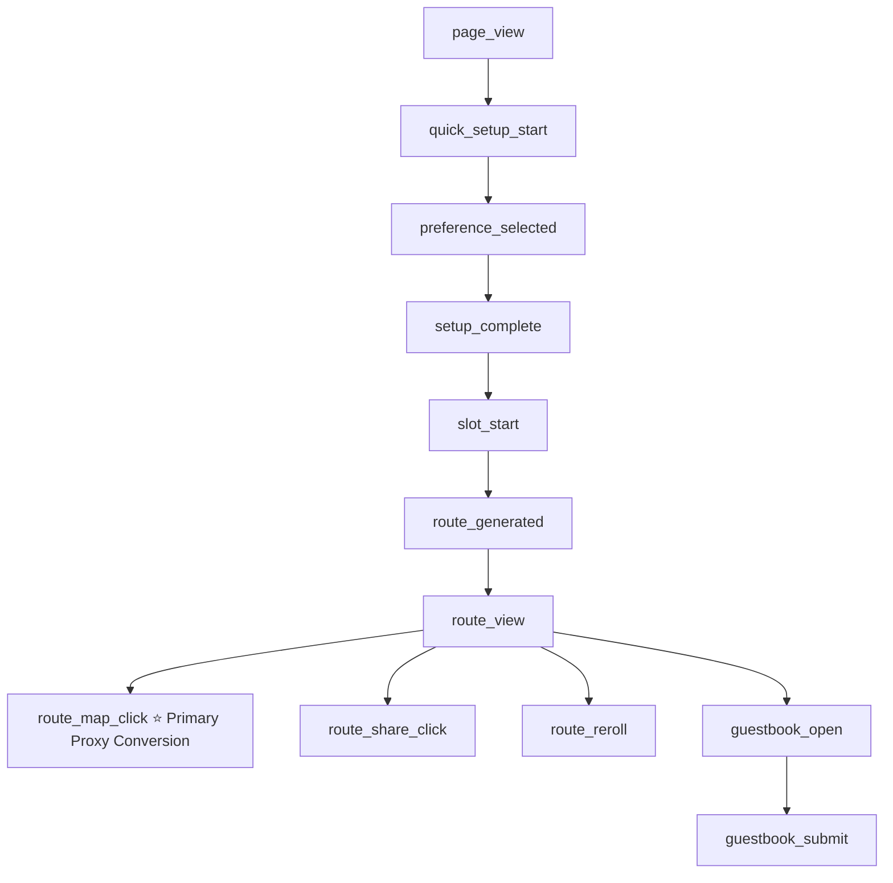

# Analytics Contract & Tracking Specification

## 1. Overview & Objective
This specification defines the Google Analytics 4 (GA4) telemetry plan for the Daejeon Random Trip MVP landing page. The primary objective is to measure user progression through the Controlled Random Travel funnel and assess performance-marketing campaign efficiency.

---

## 2. Core Event Funnel

### Event Catalog

| Event Name | Trigger Condition | Intended Parameters |
| :--- | :--- | :--- |
| `page_view` | User loads the landing page | Standard GA4 parameters (page path, title; session attribution via landing UTMs) |
| `quick_setup_start` | User clicks to begin setup / interacts with Q1 | None (standard session context) |
| `preference_selected` | User chooses an option in Q1 or Q2 | `question_index` (`q1`, `q2`), `option_value` (`half`, `full`, `food`, etc.) |
| `setup_complete` | All required preferences answered, transition to READY | `duration_type`, `preference_type` |
| `slot_start` | Slot machine spin animation starts | `duration_type`, `preference_type` |
| `route_generated` | Recommendation engine produces a route result | `route_id`, `zone_id`, `stop_count` |
| `route_view` | Visual reels stop and route itinerary is displayed inline | `route_id`, `zone_id`, `duration_type`, `preference_type` |
| `route_map_click` | **Primary Proxy Conversion**: User clicks `“이 코스로 가보기”` (Map / Navigation link) | `route_id`, `zone_id`, `reroll_count` |
| `route_share_click` | User clicks `“내 루트 공유하기”` | `route_id`, `share_method` (`link_copy`, `kakao`, `system_share`, etc.) |
| `route_reroll` | User clicks `“다시 뽑기”` | `route_id`, `reroll_count` |
| `guestbook_open` | User scrolls to or expands the guestbook section | `route_id` |
| `guestbook_submit` | User successfully posts a guestbook entry | `route_id` |

---

## 3. Allowed vs. Prohibited Parameters

### Allowed Safe Parameters
- `route_id` (anonymized string/hash)
- `zone_id` (identifier of the recommended zone)
- `duration_type` (`half` / `full`)
- `preference_type` (`anything` / `food` / `walk` / `photo`)
- `reroll_count` (integer count of rerolls within current session)
- `question_index` (`q1` / `q2`)
- `option_value` (categorical enum)
- `stop_count` (number of stops in route)
- `share_method` (`link_copy` / `kakao` / `system_share` / etc.)

### ⛔ Strict PII & Free-Text Prohibition
- **NEVER** transmit guestbook nicknames.
- **NEVER** transmit guestbook message content or arbitrary free-text strings.
- **NEVER** explicitly collect or send IP addresses, emails, phone numbers, or personal identifiers as custom event parameters or user properties.
- All analytics payload helpers in `src/lib/analytics/` must enforce input sanitization and parameter whitelisting before dispatching events to `gtag`.

---

## 4. Primary Proxy Conversion Metric

> **Honest Proxy Disclosure**:
> This web MVP cannot directly verify whether a user physically travels to Daejeon (e.g., GPS background tracking or offline redemption verification is out of scope).
> 
> Therefore, **`route_map_click`** (clicks on the primary action button `“이 코스로 가보기”` leading to map navigation) serves as the **high-intent proxy conversion** for campaign evaluation.

Secondary conversion indicators include `route_share_click` and `guestbook_submit`.

---

## 5. Marketing Campaign Attribution (UTM Parameters)

Standard UTM parameters are captured on initial landing by GA4 for marketing campaign attribution:
- `utm_source`: Ad platform or traffic channel (e.g., `instagram`, `meta`, `naver`)
- `utm_medium`: Campaign medium (e.g., `cpc`, `story`, `feed`)
- `utm_campaign`: Campaign identifier
- `utm_content`: Ad creative / variation identifier
- `utm_term`: Keyword target (if applicable)

> **Note**: UTM parameters are captured on landing for GA4 campaign attribution. Internal UI states and custom event dispatchers do not need UTM query strings propagated through them or duplicated in event payloads.

---

## 6. Pre-Launch Quality Assurance (GA4 Debug Mode & Validation)

Before launching any paid performance marketing:
1. **GA4 Debug Mode Verification**: QA engineer/developer should verify tracking using GA4 DebugView / Google Tag Assistant / debug mode across question selections, slot spins, map CTAs, route sharing, and guestbook submissions.
2. **Payload Inspection**: Verify in DebugView that all event names match this specification exactly and that **zero** free-text strings or unexpected custom parameters appear in event parameters.
3. **UTM Attribution Check**: Validate that landing with query parameters correctly associates sessions with campaign source tags in GA4 reports.
