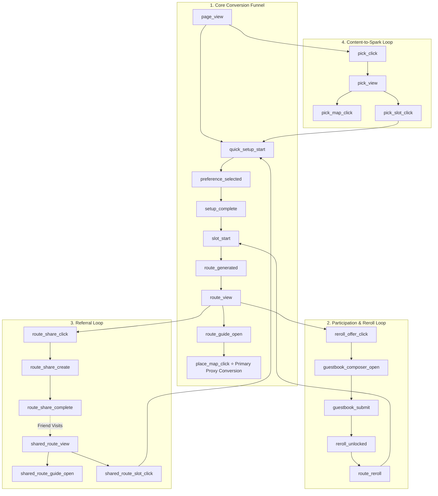

# Analytics Contract & Tracking Specification

## 1. Overview & Objective
This specification defines the Google Analytics 4 (GA4) telemetry plan for the Daejeon Random Trip MVP. It measures user progression across the four growth loops:
1. **Core Conversion**: Setup → Spin → Result Card → Route Guide → Outbound Map Click.
2. **Participation & Reward**: Result Card → Visitor Log → Reroll Unlock → Second Spin.
3. **Referral Loop**: Result Card → Share Snapshot → `/r/[shareCode]` → New User Slot Spin.
4. **Content-to-Spark**: Today's Pick → Detail Page → Seed Q2 → Slot Spin.

---

## 2. Comprehensive Event Funnel

---

## 3. Event Catalog

### 3.1 Core Conversion Events
| Event Name | Trigger Condition | Intended Parameters |
| :--- | :--- | :--- |
| `page_view` | User loads the landing page | Standard GA4 parameters (page path, title, session attribution via UTMs) |
| `quick_setup_start` | User clicks to begin setup / interacts with Q1 | None (standard session context) |
| `preference_selected` | User chooses an option in Q1 or Q2 | `question_index` (`q1`, `q2`), `option_value` (`half`, `full`, `food`, etc.) |
| `setup_complete` | All required preferences answered, transition to READY | `duration_type`, `preference_type` |
| `slot_start` | Slot machine spin animation starts | `duration_type`, `preference_type`, `is_reroll` (`0` or `1`) |
| `route_generated` | Recommendation engine produces a route result | `route_id`, `zone_id`, `stop_count` |
| `route_view` | Result Card overlay is displayed and becomes visible to user | `route_id`, `zone_id`, `duration_type`, `preference_type` |
| `route_guide_open` | User clicks `“이 코스로 가보기”` on Result Card to view Route Guide | `route_id`, `zone_id`, `stop_count` |
| `place_map_click` | **Primary Proxy Conversion**: User clicks an outbound map link in Route Guide | `route_id`, `zone_id`, `place_id`, `stop_index`, `map_service` |

### 3.2 Participation & Reroll Events
| Event Name | Trigger Condition | Intended Parameters |
| :--- | :--- | :--- |
| `reroll_offer_click` | User clicks `“랜덤 로그 남기고 1회 더 뽑기”` on Result Card | `route_id` |
| `guestbook_composer_open`| Visitor Log composer modal/section becomes active | `route_id` |
| `guestbook_submit` | User submits a visitor log entry | `route_id`, `zone_id`, `avatar_id` |
| `reroll_unlocked` | Server DB insertion succeeds and 1 reroll is awarded | `route_id` |
| `route_reroll` | User triggers second spin using the reward reroll | `route_id`, `reroll_count` (`1`) |

### 3.3 Referral Share Events
| Event Name | Trigger Condition | Intended Parameters |
| :--- | :--- | :--- |
| `route_share_click` | User clicks `“내 루트 공유하기”` on Result Card | `route_id` |
| `route_share_create` | Route snapshot successfully saved in DB and share URL generated | `route_id`, `zone_id` |
| `route_share_complete` | Web Share API triggered or share link copied to clipboard | `route_id`, `share_method` (`web_share`, `clipboard`) |
| `shared_route_view` | Recipient visits `/r/[shareCode]` | `zone_id`, `duration_type`, `preference_type` |
| `shared_route_guide_open`| Recipient clicks `“이 코스 그대로 가보기”` on shared route page | `zone_id`, `duration_type`, `preference_type` |
| `shared_route_slot_click` | Recipient clicks `“나도 여행 뽑아보기”` on shared route page | `zone_id`, `duration_type`, `preference_type` |

> **Telemetry Rule on Referral Identifiers**: High-cardinality user-specific referral codes (`share_code`) are **never** transmitted to GA4 as event parameters. Aggregate viral performance is tracked via standardized funnel events (`route_share_complete`, `shared_route_view`, `shared_route_slot_click`) and low-cardinality categorical dimensions.

### 3.4 Today's Pick Events
| Event Name | Trigger Condition | Intended Parameters |
| :--- | :--- | :--- |
| `pick_click` | User clicks Today's Pick widget on Landing page | `pick_id`, `pick_slug` |
| `pick_view` | User views `/pick/[slug]` detail page | `pick_id`, `pick_slug` |
| `pick_map_click` | User clicks outbound map link on Pick detail page | `pick_id`, `map_service` |
| `pick_slot_click` | User clicks `“이 분위기로 여행 뽑기”` on Pick detail page | `pick_id`, `seeded_preference` |

> **Note on Today's Pick Flow**: Clicking `pick_slot_click` navigates back to Landing with the Q2 preference pre-seeded, transitioning to `quick_setup_start`. When the user selects Q1 Duration, the seeded `preference_type` is captured upon `setup_complete`. No redundant preference selection event is dispatched.

---

## 4. Allowed Parameters vs. Strict Privacy Guardrails

### Allowed Safe Parameters
- `route_id` (anonymized string/hash)
- `zone_id` (zone identifier)
- `place_id` (place identifier)
- `stop_index` (integer 1–4)
- `stop_count` (integer count of stops)
- `duration_type` (`'half'` / `'full'`)
- `preference_type` (`'anything'` / `'food'` / `'walk'` / `'photo'`)
- `question_index` (`'q1'` / `'q2'`)
- `option_value` (categorical enum)
- `is_reroll` (`0` or `1`)
- `reroll_count` (`0` or `1`)
- `share_method` (`'web_share'` / `'clipboard'`)
- `avatar_id` (categorical Kkumssi family avatar identifier)
- `pick_id` / `pick_slug` (curated pick identifier)
- `seeded_preference` (`'food'` / `'walk'` / `'photo'` / `'anything'`)
- `map_service` (`'naver'` / `'kakao'` / `'generic'`)

### ⛔ Strict PII & Free-Text Prohibition
- **NEVER** transmit Visitor Log nicknames.
- **NEVER** transmit Visitor Log message strings or arbitrary user free-text inputs.
- **NEVER** transmit user-specific `share_code` strings to prevent high-cardinality dimension bloat.
- **NEVER** transmit IP addresses, emails, phone numbers, or personal identifiers as custom parameters or user properties.
- Parameter whitelisting and input sanitization are strictly enforced in `src/lib/analytics/` prior to dispatching events to `gtag`.

---

## 5. Primary Proxy Conversion Metric

> **Honest Proxy Disclosure**:
> This web MVP cannot directly verify whether a user physically travels to Daejeon (offline redemption verification and background GPS tracking are intentionally out of scope).
> 
> Therefore, **`place_map_click`** (clicks on outbound map links within the in-app Route Guide) serves as the **Primary High-Intent Proxy Conversion** for performance-marketing campaign evaluation.
>
> Outbound map clicks on Today's Pick detail pages (`pick_map_click`) serve as a secondary content and travel-intent signal.
>
> These reflect high travel intent, not physical visit completion, and must not be misinterpreted as confirmed offline attendance.

Secondary conversion indicators include `route_share_complete`, `guestbook_submit`, and `pick_map_click`.

---

## 6. Marketing Campaign Attribution (UTM Parameters)

Standard UTM query parameters are captured on landing by GA4 for campaign attribution:
- `utm_source`: Traffic channel / ad platform (e.g., `instagram`, `meta`, `naver`)
- `utm_medium`: Campaign medium (e.g., `cpc`, `story`, `feed`)
- `utm_campaign`: Campaign identifier
- `utm_content`: Creative variant
- `utm_term`: Keyword target (if applicable)

> **Note**: UTM parameters are handled natively by GA4 on landing; internal component state and custom event payloads do not replicate UTM parameters.

---

## 7. Pre-Launch Quality Assurance (GA4 Debug Mode & Validation)

Before launching any paid performance marketing campaign:
1. **GA4 Debug Mode Verification**: QA engineer/developer verifies tracking using GA4 DebugView / Google Tag Assistant across all 4 growth loops (setup questions, slot spins, in-app Route Guide map CTAs, referral sharing, and guestbook submissions).
2. **Payload & Cardinality Inspection**: Verify in DebugView that all event names match this specification exactly and that **zero** free-text strings, high-cardinality `share_code` values, or unexpected PII parameters appear in event payloads.
3. **UTM Attribution Check**: Validate that landing with query parameters correctly associates sessions with campaign source tags in GA4 reports.

---

## 8. Campaign & Funnel Analysis Dashboard Deliverable

### 8.1 Purpose & Role
The **Campaign & Funnel Analysis Dashboard** is a **required project deliverable** alongside client telemetry instrumentation. Its purpose is to make paid-traffic acquisition, marketing campaign efficiency, growth-loop funnel drop-offs, and proxy conversions easily analyzable without requiring stakeholders to repeatedly inspect raw GA4 exploration tables.

*(Note: The specific dashboard platform—e.g., Looker Studio report, GA4 Custom Exploration template, or another lightweight analysis layer—remains an upcoming implementation decision; the analytical views below define the required functional contract).*

### 8.2 Required Analysis Areas & Views
All dashboard views rely **strictly** on the events, dimensions, and parameters already defined in this specification (zero new telemetry or PII):

1. **Acquisition & Campaign Attribution (UTM Performance)**:
   - Evaluates incoming traffic volume, engagement, and conversion efficiency grouped by `utm_source`, `utm_medium`, `utm_campaign`, `utm_content`, and `utm_term`.
   - Compares traffic sources and campaign attribution against downstream intent (`place_map_click`, `route_share_complete`).

2. **Core Conversion Funnel & Step Drop-Off**:
   - Visualizes step-by-step conversion rates and identifies drop-off friction across the core flow:
     `page_view` → `quick_setup_start` → `setup_complete` → `slot_start` → `route_generated` → `route_view` → `route_guide_open` → `place_map_click` (Primary Proxy Conversion).

3. **Route Guide & Outbound Map Engagement**:
   - Analyzes high-intent engagement on `place_map_click` and `pick_map_click`.
   - Breaks down map actions by `map_service` (`naver` vs. `kakao`), `zone_id`, and `stop_index` (1–4).

4. **Guestbook & Rewarded Reroll Participation**:
   - Monitors the participation loop: `route_view` → `reroll_offer_click` → `guestbook_composer_open` → `guestbook_submit` → `reroll_unlocked` → `route_reroll`.
   - Tracks avatar selection distribution (`avatar_id`) and reroll conversion lift.

5. **Referral & Virality Performance**:
   - Measures organic sharing and referral acquisition: `route_share_click` → `route_share_create` → `route_share_complete` (by `share_method`: `web_share` vs. `clipboard`) → `shared_route_view` → `shared_route_guide_open` / `shared_route_slot_click` (new landing user acquisition).

6. **Preference & Duration Segmentation**:
   - Analyzes traveler intent breakdown across permitted categorical dimensions: `duration_type` (`half` vs. `full`), `preference_type` (`food`, `walk`, `photo`, `anything`), and recommended `zone_id`.
