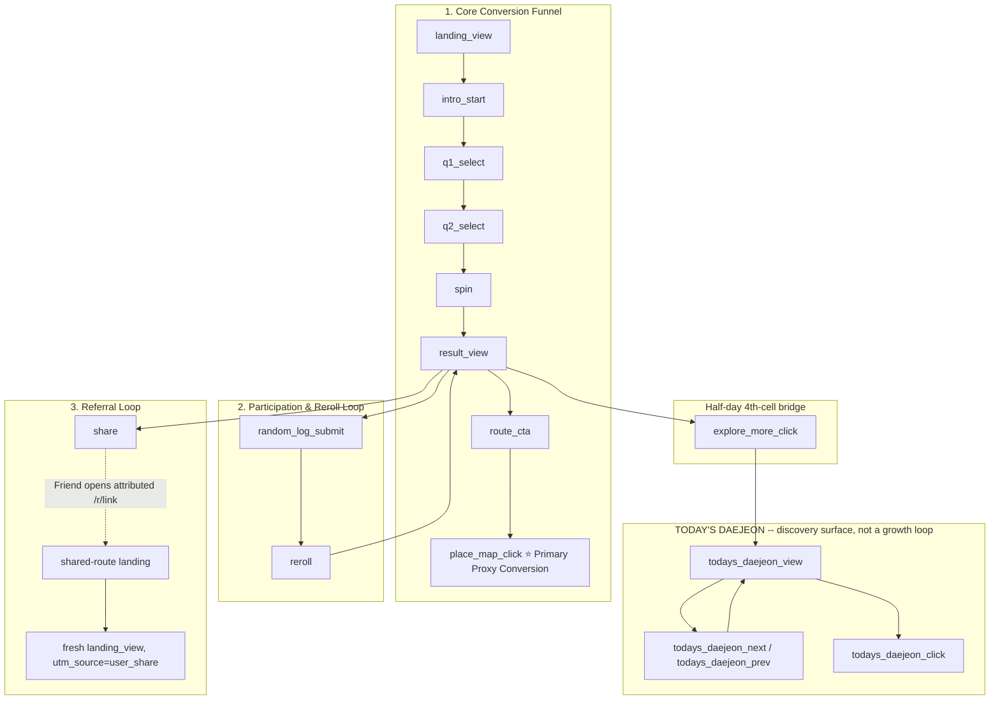

# Analytics Contract & Tracking Specification

## 1. Overview & Objective
This specification defines the Google Analytics 4 (GA4) / Google Tag Manager (GTM) telemetry plan for the Daejeon Random Trip MVP. The campaign this supports is **organic, free-distribution growth** (social posts, community boards, messenger shares) — not a paid-media campaign — so this document measures channel/creative performance and viral reach, not cost-per-acquisition. It measures user progression across the three growth loops:
1. **Core Conversion**: Setup → Spin → Result Card → Route Guide → Outbound Map Click.
2. **Participation & Reward**: Result Card → Memory Log → Reroll Unlock → Second Spin. *(User-facing name; ADR-034 in `docs/DECISIONS.md`. The `random_log_submit` event name below is the current, implemented identifier — see §3.)*
3. **Referral Loop**: Result Card → Share → `/r/[shareCode]` (tagged `user_share`/`referral`) → New User Slot Spin.

> **TODAY'S DAEJEON (renamed from Today's Pick) is not a growth loop.** It is a Right Rail editorial carousel (ADR-015 revised, ADR-038). It now has its own implemented impression/navigation/click event family (`todays_daejeon_*`, see §3) — this is discovery-surface telemetry, not a growth-loop step.

---

## 2. Comprehensive Event Funnel

This is the **implemented** funnel as of the GTM/custom-event launch pass (§9). It supersedes the earlier spec-only funnel (`quick_setup_start` → `preference_selected` → `setup_complete` → `slot_start` → `route_generated` → `route_view` → ...), which was never instrumented and has been retired in favor of the simpler, now-shipped 16-event taxonomy below.



Notes on this funnel vs. the product's own reroll mechanics (ADR-011): `reroll` fires for the *rewarded* second spin only, as its own distinct event -- it is never accompanied by a second `spin` event for the same action (see §3). `random_log_submit` is the one and only reward-eligibility trigger; there is no separate `reroll_offer_click`/`guestbook_composer_open`/`reroll_unlocked` step in the implemented taxonomy -- those intermediate spec-only events from the original funnel draft were consolidated into the two events that actually matter for measurement (did they submit a log, did they get a second spin).

---

## 3. Event Catalog (Implemented -- 16 Events)

All 16 events below are **implemented** (`src/lib/analytics/`), dispatched exclusively via `pushDataLayerEvent(eventName, params)` (`src/lib/analytics/dataLayer.ts`), which pushes `{ event: eventName, ...params }` onto `window.dataLayer`. No component calls `window.dataLayer` directly. Every push automatically carries the session's first-touch UTM attribution (§6) in addition to the params listed below -- call sites never pass UTM values themselves.

| Event Name | Trigger Condition | Dispatch Site | Parameters |
| :--- | :--- | :--- | :--- |
| `landing_view` | Fires once per browser tab-session, on the main landing experience's first mount | `AnalyticsBootstrap` (`src/components/analytics/AnalyticsBootstrap.tsx`), mounted once in `page.tsx` | — |
| `intro_start` | User clicks the INTRO gate's `"여행 시작하기"` CTA | `ExperienceProvider.handleStartIntro` | — |
| `q1_select` | User selects a Q1 duration option | `SetupArea.handleSelectDuration` | `duration_type` |
| `q2_select` | User selects a Q2 preference option | `SetupArea.handleSelectPreference` | `preference_type` |
| `spin` | The initial valid route-generation spin starts (never fires for a rewarded reroll -- see `reroll` below) | `ExperienceProvider.handleSpin`, immediately after `generateRoute()` succeeds | `duration_type`, `preference_type` |
| `result_view` | A newly generated Result actually becomes revealed (the `'peek' -> 'revealed'` transition) -- never on Result's own re-render, never on reopen-from-minimized | `ExperienceProvider`'s peek-completion effect (`reconcile()`) | `route_id`, `zone_id`, `stop_count`, `duration_type`, `preference_type` |
| `route_cta` | User clicks `"이 코스로 가보기"` on the Result Card | `ExperienceOverlays`, inside the `onOpenRouteGuide` handler | `route_id`, `zone_id` |
| `place_map_click` | **Primary Proxy Conversion.** User clicks an outbound Naver/Kakao map link inside the Route Guide | `RouteGuideTimeline`'s map-link `onClick` handlers | `route_id` (absent for a shared-route snapshot -- see note below), `zone_id` |
| `share` | `triggerShare()` resolves to a genuinely completed share -- native Web Share actually sent, or the clipboard fallback actually copied. A canceled share sheet or a copy failure never counts | `ResultActions.handleShare`, after `triggerShare()` resolves | `route_id`, `zone_id`, `share_method` (`native_share` \| `clipboard`) |
| `reroll` | The one rewarded reroll is actually executed (never accompanied by a `spin` event for the same action) | `ExperienceProvider.handleExecuteReroll`, after the reward is consumed and route generation succeeds | `route_id`, `zone_id` (referencing the route being replaced) |
| `todays_daejeon_view` | An item impression -- a banner that was actually **on screen**: the first one exposed, and each different banner that becomes active thereafter, whether browsed to (next/prev/swipe) or reached by the ~2s auto-advance (ADR-042; auto movement fires this impression but never `todays_daejeon_next`/`prev`). Gated on the card being ≥50% in the viewport (ADR-047), so a mounted-but-offscreen rail -- including the hidden responsive twin -- reports nothing | `EditorialSpotlightCard`, an effect keyed on the active item, guarded against the dual-mounted desktop/mobile rail (see §7) | `editorial_id`, `editorial_position` |
| `todays_daejeon_next` / `todays_daejeon_prev` | User advances the carousel via button or swipe (both call through the same `goNext`/`goPrev` seam) | `EditorialSpotlightCard.goNext` / `.goPrev` | `editorial_id`, `editorial_position` (of the item becoming active) |
| `todays_daejeon_click` | A genuine outbound banner click-through (never a swipe artifact) | `EditorialSpotlightCard.handleBannerClick` | `editorial_id`, `editorial_position`, `editorial_url` |
| `explore_more_click` | User clicks `"대전 더 둘러보기"` on the half-day Result's 4th-cell banner, before the minimize/scroll side effect | `ExperienceProvider.handleExploreMore`, top of function | `route_id`, `zone_id` (when available) |
| `random_log_submit` | `POST /api/guestbook` returns a confirmed success -- never on a submit attempt, client-side validation error, or failed POST | `GuestbookComposer.handleSubmit`, immediately after the success check passes | `route_id`, `zone_id`, `duration_type`, `preference_type` |

**Note on `place_map_click` and shared routes**: `RouteGuideModal`/`RouteGuideTimeline` is the same shared component for both the live Result flow and a recipient's `/r/[shareCode]` view. `route_id` is populated only for a live-generated route (`RouteGuideData.routeId`, sourced from `RouteResult.id`); it is intentionally absent for a shared-route snapshot (no live route id exists to reference there), while `zone_id` is present in both cases. This is **not** the deferred shared-route recipient event family below -- it is the existing `place_map_click` event naturally firing from a component both flows already share.

### Deferred (explicitly NOT implemented in this pass)
- **Shared-route recipient interaction events** (`shared_route_view`, `shared_route_guide_open`, `shared_route_slot_click`): not built. Inbound shared-route traffic is already distinguishable via the `user_share`/`referral`/`shared_route` UTM tag (§6) plus the `/r/[shareCode]` page path alone -- sufficient for launch. A dedicated recipient-interaction event family is a candidate post-launch enhancement.
- **Looker Studio / Campaign & Funnel Analysis Dashboard** (§8): not built.

Two intermediate spec-only event names from the original funnel draft (`guestbook_composer_open`, `reroll_offer_click`, `reroll_unlocked`, `route_reroll`, `route_generated`, `route_view`, `route_guide_open`, `route_share_click`, `route_share_create`, `route_share_complete`, `preference_selected`, `setup_complete`, `slot_start`, `quick_setup_start`) are **retired, not implemented under those names** -- the shipped taxonomy is the 16-event table above. Do not reintroduce them without a new product decision; if similar funnel granularity is wanted later, extend the 16-event table explicitly rather than reviving the old names.

---

## 4. Allowed Parameters vs. Strict Privacy Guardrails

### Allowed Parameters (enforced centrally, `src/lib/analytics/events.ts`)
- `duration_type` (`'half'` / `'full'`)
- `preference_type` (`'anything'` / `'food'` / `'walk'` / `'photo'`)
- `zone_id` (zone identifier)
- `route_id` (ephemeral client-generated route id -- never a database primary key, never `share_code`)
- `stop_count` (integer count of stops)
- `editorial_id` (`EditorialItem.id` -- stable, feature-name-agnostic)
- `editorial_position` (1-based carousel position at the time of the event)
- `editorial_url` (the banner's outbound destination, `todays_daejeon_click` only)
- `share_method` (`'native_share'` \| `'clipboard'`)
- `utm_source`, `utm_medium`, `utm_campaign`, `utm_content` -- attached automatically by the dispatcher from the session's stored first-touch attribution (§6); never passed by call sites, and `utm_term` is never captured or sent.

Any parameter not on this list is silently dropped by `pushDataLayerEvent`, not sent. `undefined`/`null`/empty-string/non-primitive (object/array/function/boolean) values are dropped rather than sent as literal `"undefined"`/`"null"` strings. Every string parameter is trimmed and capped at 100 characters as a defensive measure -- these are short categorical tokens, never free text.

### ⛔ Strict PII & Free-Text Prohibition (unchanged, ADR-005)
- **NEVER** transmit Memory Log nicknames.
- **NEVER** transmit Memory Log message strings or arbitrary user free-text inputs.
- **NEVER** transmit user-specific `share_code` strings (high-cardinality dimension bloat risk, and a re-identification concern for an otherwise-anonymous share link).
- **NEVER** transmit place names, IP addresses, emails, phone numbers, or other personal identifiers.
- Whitelisting and sanitization are enforced in exactly one place, `src/lib/analytics/dataLayer.ts`'s `pushDataLayerEvent`, not left to call-site discipline.

---

## 5. Primary Proxy Conversion Metric

> **Honest Proxy Disclosure**:
> This web MVP cannot directly verify whether a user physically travels to Daejeon (offline redemption verification and background GPS tracking are intentionally out of scope).
>
> Therefore, **`place_map_click`** (clicks on outbound map links within the in-app Route Guide) serves as the **Primary High-Intent Proxy Conversion** for this organic growth campaign's evaluation. This event is now implemented (§3) -- it was previously spec-only.
>
> This reflects high travel intent, not physical visit completion, and must not be misinterpreted as confirmed offline attendance.

Secondary conversion indicators: `share` (genuinely completed shares only) and `random_log_submit` (confirmed successful DB writes only).

---

## 6. Marketing Campaign Attribution (UTM Parameters)

### 6.1 Incoming campaign attribution (session preservation)
Standard UTM query parameters are captured on landing by GA4/GTM for campaign attribution, and are **also** captured client-side into `sessionStorage` (`src/lib/attribution/utmSession.ts`) so the session's first-touch attribution can be replayed onto every later custom event -- **correcting the previous version of this document**, which stated *"internal component state and custom event payloads do not replicate UTM parameters."* That statement is no longer accurate: `pushDataLayerEvent` now automatically attaches the four fields below to every event it sends (§3, §4).

- `utm_source`: Traffic channel (e.g. `x`, `instagram`, `threads`, `tiktok`, `youtube`, `albamon`, `linkareer`, `daangn`, `everytime`, `kakao_openchat`, `tistory`, `brunchstory`, `iboss`, `naver_clip`, `naver_blog`) -- **not a closed enum**; any future channel value works with zero code change.
- `utm_medium`: Campaign medium (e.g. `social`).
- `utm_campaign`: Campaign identifier (current campaign: `daejeon_random_trip_2026`).
- `utm_content`: Creative variant.
- `utm_term`: **Intentionally never captured, stored, or sent.**

**Capture rules** (`captureUtmAttribution()`):
- Runs once, on the client's initial landing, before `landing_view` dispatches (`AnalyticsBootstrap`, §7).
- **First-touch wins for the browser tab-session**: once an attribution is stored, it is never overwritten by a later value for the remainder of that `sessionStorage` session.
- An internal navigation with no `utm_*` query params at all is a no-op -- it can never clobber a real first-touch value with nothing.
- Stored in `sessionStorage` only (`daejeon_random_trip_utm_attribution`), never cookies.
- Fails silently if storage is unavailable (SSR, private browsing quota limits, etc.) -- matches the existing `rerollSession.ts`/`visitSession.ts` contract.

### 6.2 Shared-route ("second-generation viral") attribution
Every shared-route link generated from the Result Card's `"내 루트 공유하기"` CTA is automatically tagged with a fixed attribution before being handed to `navigator.share`/clipboard copy (`getAttributedShareUrl`, `src/lib/share/shareHelper.ts`):

```
/r/[shareCode]?utm_source=user_share&utm_medium=referral&utm_campaign=daejeon_random_trip_2026&utm_content=shared_route
```

- Built via the native `URL`/`URLSearchParams` API, never string concatenation -- the `/r/[shareCode]` path segment itself is never altered, only the query string is appended.
- The values are **fixed and never platform-guessed**: `navigator.share` does not reveal which app the recipient ultimately chose, so no `kakao`/`instagram`/`x`-style per-platform source is invented for this path.
- The bare, unparameterized `getShareUrl(shareCode)` is preserved unchanged and still used wherever a UTM-free URL is required (e.g. the `/r/[shareCode]` canonical/OG metadata in `generateMetadata`, which must not carry campaign tags).
- The recipient's browser needs no special handling: these are ordinary `utm_*` query params, so GA4/GTM's standard landing-parameter capture and the client-side session capture (§6.1) both pick them up exactly as they would for any other campaign visitor. This is what lets standard GA4 acquisition reporting distinguish an **original campaign visitor** (e.g. `x` / `social` / `daejeon_random_trip_2026` / a real creative tag) from a **friend opening a shared route** (`user_share` / `referral` / `daejeon_random_trip_2026` / `shared_route`) with zero additional instrumentation.

---

## 7. GTM Architecture & Duplicate-Firing Prevention

### 7.1 Mutually-exclusive GA4 loader (single `page_view` rule)
`src/app/layout.tsx` renders **at most one** of the two `@next/third-parties/google` components, gated on env vars:

```
NEXT_PUBLIC_GTM_ID set                                  -> <GoogleTagManager> ONLY
NEXT_PUBLIC_GTM_ID unset, NEXT_PUBLIC_GA_MEASUREMENT_ID set -> <GoogleAnalytics> fallback (pre-GTM behavior, unchanged)
Neither set                                              -> neither loader renders
```

`<GoogleTagManager>` and `<GoogleAnalytics>` must **never** both render: each injects its own independent `gtag.js` and calls `gtag('config', ...)`, and GA4 does not deduplicate across separate config calls -- rendering both would fire two `page_view` hits per navigation to the same property. Once GTM owns `page_view` (via `Google Tag - GA4`, configured in the GTM UI -- see §10), the direct `<GoogleAnalytics>` component must not also render. `NEXT_PUBLIC_GA_MEASUREMENT_ID` is deliberately kept as a supported fallback/rollback path -- removing `NEXT_PUBLIC_GTM_ID` from Vercel env instantly reverts to the pre-GTM direct-GA4 loader with no code change. **`page_view` is never pushed manually from application code** -- it is owned exclusively by whichever loader is active.

### 7.2 Duplicate-firing safeguards actually implemented
1. **page_view**: see 7.1 -- structurally impossible to double-fire once the mutually-exclusive loader is in place.
2. **Dual-mount impression duplication**: `page.tsx` renders `RightSidebar` (and therefore `EditorialSpotlightCard`) twice -- once for the desktop column, once for the mobile `#mobile-right-rail` wrapper -- gated only by CSS (`hidden lg:flex` / `lg:hidden`); both instances are always mounted simultaneously. `todays_daejeon_view`'s mount/update effect checks `sectionRef.current.offsetParent !== null` before dispatching, so only the instance actually on screen fires the impression. Click-driven events (`todays_daejeon_next/prev/click`) need no such guard -- only the visible instance is interactive.
3. **React StrictMode double-invoke (dev only)**: verified locally that a plain mount effect double-fires under Next.js's default `reactStrictMode: true` in dev (mount -> cleanup -> mount again). `landing_view` guards against this with a `sessionStorage`-based claim-before-dispatch (mirroring `visitSession.ts`'s `claimVisitOnce()`); `todays_daejeon_view` guards against it with a `lastViewedItemIdRef` comparison so the same item-becoming-active doesn't dispatch twice in the same commit, while still firing again for a genuine later re-impression of that item.
4. **`result_view` on reopen**: fires only on the `'peek' -> 'revealed'` transition inside `ExperienceProvider`'s single-instance peek-completion effect, guarded by a per-run `resultViewDispatched` flag (so the timer and a possible visibilitychange reconciliation can't double-fire it) -- reopening a minimized Result never re-enters `'peek'`, so it structurally cannot re-dispatch `result_view`.
5. **`share` on cancel/error**: dispatched only when `triggerShare()` resolves to `'shared'` or `'copied'` -- a canceled native share sheet or a clipboard failure never counts.
6. **`reroll` vs. `spin`**: the two are separate, mutually exclusive dispatch sites (`handleSpin` vs. `handleExecuteReroll`) -- a rewarded reroll never also fires `spin`.
7. **`todays_daejeon_click` on swipe**: `handleBannerClick` returns before dispatching whenever the click follows a swipe that already changed slides (`suppressNextClickRef`), so a swipe-triggered slide change never also counts as a banner click-through.
8. **`random_log_submit` on failure**: dispatched only after `POST /api/guestbook` returns a confirmed `response.ok && data.success` -- a validation error or failed POST never fires it (verified during implementation against a real failing POST; the successful path was subsequently confirmed in GTM Preview, §9).

---

## 8. Campaign & Funnel Analysis Dashboard Deliverable (Deferred -- Not Built)

A Campaign & Funnel Analysis Dashboard (Looker Studio, a GA4 Custom Exploration template, or another lightweight analysis layer) remains a **required, not-yet-built** project deliverable. Nothing in this section is implemented; this is unchanged from the prior version of this document except that the underlying events it would report on (§3) are now real rather than spec-only. The required analysis areas (acquisition/UTM performance, core conversion funnel, outbound map engagement, participation/reroll, referral/virality, preference/duration segmentation) are unchanged in intent from the original spec and should be re-derived against the 16-event taxonomy in §3 when this work is picked up.

---

## 9. Current Implementation State

> Everything above this section is the **measurement contract/spec**. This section is the current, closed-out implementation state of the GTM/custom-event pass (`feat/analytics-tracking`, ADR-039) -- **merged to `main`, deployed to Vercel Production, container published, and production-verified**.

- **Status**: GTM integration, the full 16-event custom taxonomy, first-touch UTM session preservation, and automatic shared-route UTM tagging are all implemented and **verified against the live production site** (not just GTM Preview / local `window.dataLayer` inspection). The branch has been merged to `main` and deployed.
- **GTM container**: `GTM-K9G6TQBM` exists, is configured (§10), and is **published**. `src/app/layout.tsx` supports `NEXT_PUBLIC_GTM_ID` (§7.1); Vercel's **Production** environment has `NEXT_PUBLIC_GTM_ID=GTM-K9G6TQBM` set, and the deployed build is running this code.
- **Custom events -- production Tag Assistant / GA4 DebugView verified**: `Google Tag - GA4` fires as the sole `page_view` source; `landing_view` fires; `GA4 Event - Product Events` fires correctly for the 16-event taxonomy via `{{Event}}`, including the events (`todays_daejeon_next/prev/click`, `explore_more_click`) that had only been confirmed via local `window.dataLayer` inspection or GTM Preview during implementation.
- **UTM session preservation**: verified against production -- first-touch attribution is captured before `landing_view` and persists correctly onto every later product event in the session.
- **Stale Data Layer Variable leak -- found in GTM Preview during implementation, fixed, and confirmed to hold in production**: `todays_daejeon_view`'s `editorial_position` was previously still resolving during a later, unrelated `q1_select` (GTM's dataLayer resolves against a running merged model, so a key simply omitted from a push does not clear a prior value). Fixed in `src/lib/analytics/dataLayer.ts`: every push explicitly resets all 9 event-specific keys to `undefined` before applying the current event's own values (§4, §7.2); UTM keys are deliberately exempt since they are session-scoped, not event-specific.
- **Shared-route UTM**: implemented (`getAttributedShareUrl`); the URL handed to `navigator.share`/clipboard matches `/r/[shareCode]?utm_source=user_share&utm_medium=referral&utm_campaign=daejeon_random_trip_2026&utm_content=shared_route`.
- **Still deferred, not implemented**:
  - The Campaign & Funnel Analysis Dashboard (§8, e.g. Looker Studio) is **not built** -- next up now that real production collection has begun.
  - Shared-route recipient interaction events (`shared_route_view`, `shared_route_guide_open`, `shared_route_slot_click`) remain **deferred, not implemented** (§3).
- **Retired event names**: `guestbook_submit`, `route_share_complete`, and the other pre-ADR-039 spec-only draft names (§3) were never implemented under those names and must not be described as current -- the shipped taxonomy is the 16-event table in §3 (`random_log_submit` and `share` are the current equivalents).

### 9.1 Production verification checklist -- all items below have PASSED
1. ~~Confirm exactly **one** `page_view` fires per navigation on the live site~~ -- **passed**, no double-count from a stray direct-GA4 load.
2. ~~Walk the Core Conversion journey ... on production and confirm each of the 16 events fires exactly once~~ -- **passed**, with exactly the documented parameters (§3) -- no nickname/message/place names/`share_code` in any payload.
3. ~~Confirm the session's UTM attribution appears on every event from `landing_view` onward~~ -- **passed**.
4. ~~Browse TODAY'S DAEJEON (view → next → prev → click) at both a desktop-width and mobile-width viewport on production and confirm the hidden responsive duplicate never emits an impression~~ -- **passed**.
5. ~~Trigger `explore_more_click` and confirm it fires before the Result minimizes~~ -- **passed**.
6. ~~Minimize and reopen the Result Card and confirm `result_view` does not re-fire~~ -- **passed**.
7. ~~Cancel a native share sheet (or force a clipboard failure) and confirm `share` does not fire; complete a real share and confirm it does, with the correct `share_method`~~ -- **passed**.
8. ~~Submit a Memory Log entry and confirm `random_log_submit` fires only after a confirmed successful `POST /api/guestbook`~~ -- **passed**.
9. ~~Generate a share link on production and confirm the URL handed to `navigator.share`/clipboard, and that opening it in a fresh session attributes to `user_share`/`referral`~~ -- **passed**.
10. ~~Re-confirm `q1_select` (or any event) never resolves a stale event-specific key from a preceding unrelated event~~ -- **passed**, the stale-DLV fix holds in production identically to Preview.

---

## 10. Manual GTM Setup (Container `GTM-K9G6TQBM` -- Published, Production-Verified)

This container exists, this exact setup was built and verified in GTM Preview mode during implementation, and it is now **published** and confirmed working against the live production site (§9/§9.1). Designed for the smallest maintainable setup: **one GA4 base tag + one generic custom-event tag**, rather than one tag per event name.

### 10.1 Variables
- **Constant**: `CONST - GA4 Measurement ID` = `G-0LV0MFSVPK`.
- **Data Layer Variables**, one per parameter key `pushDataLayerEvent` ever sends (§4): 13 DLVs covering `duration_type`, `preference_type`, `zone_id`, `route_id`, `stop_count`, `editorial_id`, `editorial_position`, `editorial_url`, `share_method`, `utm_source`, `utm_medium`, `utm_campaign`, `utm_content`.
- Built-in **Event** variable (reads `{{Event}}`, the literal `event` key from each `dataLayer.push`) -- used as the GA4 Event tag's Event Name field (10.3), no manual creation needed.

### 10.2 Trigger
`CE - Product Analytics Events` -- one **Custom Event** trigger, matching all 16 approved event names and nothing else, via a regex-equals condition on `{{Event}}`:

```
^(landing_view|intro_start|q1_select|q2_select|spin|result_view|route_cta|place_map_click|share|reroll|todays_daejeon_view|todays_daejeon_next|todays_daejeon_prev|todays_daejeon_click|explore_more_click|random_log_submit)$
```

A single anchored-regex trigger is deliberately preferred over 16 separate Custom Event triggers -- it is one place to extend when a 17th event is later approved, and the anchoring (`^...$`) prevents an unrelated future `dataLayer` push (e.g. from a third-party script) from accidentally matching.

### 10.3 Tags
1. **`Google Tag - GA4`**: the Google tag, Measurement ID via `CONST - GA4 Measurement ID`, firing on **Initialization - All Pages**. This is the **only** `page_view` source once GTM is live -- no second page_view-sending tag exists in the container.
2. **`GA4 Event - Product Events`**: a generic GA4 Event tag, Event Name = `{{Event}}` (the built-in variable, not a literal string) so this single tag reads whichever of the 16 approved names actually fired; all 13 DLVs from 10.1 mapped as Event Parameters (a param absent from a given push simply resolves empty and is omitted by GA4, which is correct since `pushDataLayerEvent` never sends empty/undefined-turned-real values). Fires on `CE - Product Analytics Events` (10.2).

This two-tag design is safe **only** because every event already goes through the same central `pushDataLayerEvent` whitelist (§3, §4) -- if a future change ever pushes a `dataLayer` event carrying a parameter this tag shouldn't forward (e.g. an unrelated third-party script), revisit whether `GA4 Event - Product Events`'s parameter mapping needs tightening or whether that event needs excluding from `CE - Product Analytics Events`'s regex.

### 10.4 Verification performed
- `Google Tag - GA4` fires on Initialization/All Pages; `GA4 Event - Product Events` fires once per event with the correct parameters -- confirmed first in GTM Preview during implementation, then re-confirmed against the live production site after publish (§9.1).
- The stale-DLV leak (§9) was found via this exact setup in GTM Preview, fixed in code, and confirmed to hold in production.
- No other tag in the container sends `page_view`.
- The container has been **published**; production Tag Assistant/GA4 DebugView verification (§9.1) has been performed and passed.
