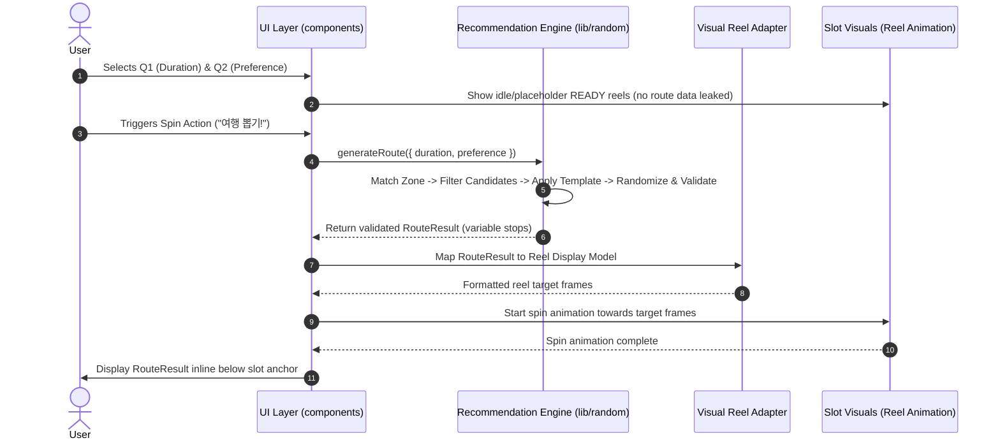
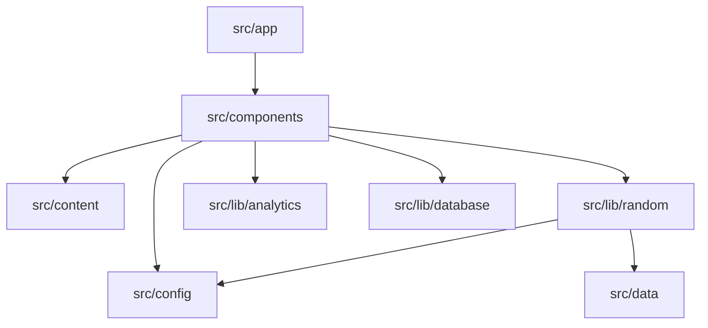

# Architecture Contract: Daejeon Random Trip

## 1. Technology Stack
- **Framework**: Next.js 16 (App Router)
- **UI Library**: React 19
- **Language**: TypeScript 5
- **Styling**: Tailwind CSS 4
- **Linter**: ESLint 9
- **Package Manager**: pnpm (tracked via `pnpm-workspace.yaml`, `packageManager`)
- **Runtime Target**: Node.js (tracked via `.node-version`)
- **Hosting Target**: Vercel (future)
- **Persistence Target**: Supabase (future)
- **Telemetry**: Google Analytics 4 (GA4)

---

## 2. Planned Module Responsibilities & Directory Blueprint

The directory structure below reflects the planned architectural boundaries for the project:

```
src/
├── app/                  # Next.js App Router pages, layouts, and route handlers
├── components/           # Reusable UI components (Slot, Layout, RouteView, RandomLog)
├── lib/
│   ├── random/           # Controlled Random Travel engine & candidate matching logic
│   ├── analytics/        # GA4 event tracking helpers and parameter sanitizers
│   └── database/         # Data access layer & Supabase client wrapper (future)
├── config/               # Modifiable product policies (reroll limits, options, weighting)
├── data/                 # Seed data: Zones, route templates, candidate place data
└── content/              # Static copy, descriptions, and user-facing text strings
public/                   # Static media: pixel art, character illustrations, audio
```

---

## 3. Conceptual Data Models & Recommendation Flow

### Data Models (Conceptual Contract)
```typescript
interface RouteResult {
  id: string;
  zoneId: string;
  durationType: 'half' | 'full';
  preference: 'anything' | 'food' | 'walk' | 'photo';
  stops: RouteStop[];
  mission?: string;
  createdAt: string;
}

interface RouteStop {
  order: number;
  placeId: string;
  name: string;
  category: string;
  durationMin: number;
  travelMin: number;
}

interface PlaceCandidate {
  id: string;
  name: string;
  category: string;
  zoneId: string;
  durationMin: number;
  tags: string[];
  address?: string;
  mapUrl?: string;
  image?: string;
  description?: string;
  active: boolean;
  // soloFriendly?: boolean; // Future-only: companion preference is not part of MVP setup
}
```

> **Important**: Route stop count is variable across templates and durations. It is completely independent of the visual reel count in the slot component. Do not make a 3-reel visual layout an architectural requirement of `RouteResult`.

### Visual Reel Decoupling & Display Flow
The product separates logical itinerary calculation from visual reel presentation through a visual adapter layer:

```
RouteResult (variable stops) ──► Visual Adapter / Reel Display Model ──► Slot Presentation
```



---

## 4. Key Architectural Boundaries & Guardrails

### 1. Engine, Visual Adapter, and READY Reel Separation
- The `lib/random` engine calculates the logical `RouteResult` via candidate filtering, random selection, template matching, and route validation independently of any UI animations (randomness can be seeded or injected for automated testing).
- An adapter layer maps variable-stop `RouteResult` data into the visual reel display format consumed by the slot presentation.
- **READY State Guardrail**: Content displayed on reels in the READY state is presentation-only idle/placeholder content. It must **never** expose or leak the generated `RouteResult` before spin completion.
- The UI reveals the detailed itinerary inline below the slot anchor only after the reels come to a full stop.

### 2. Spin Action vs. Visual Lever Mechanism
- The fixed product behavior is the **Spin Action** (`“여행 뽑기!”`) and its corresponding state transition (`READY` → `SPIN` → `RESULT`).
- The lever is strictly an engaging visual interaction / feedback mechanism.
- The application must function reliably if:
  - lever animation fails or is disabled,
  - lever visual assets are changed,
  - lever is removed entirely in a future skin.
- The lever must **never** become a separate required action, a blocking prerequisite, or a second primary CTA.

### 3. Layout Stability Boundary
- The page follows a clear sectional hierarchy: `Setup Area` → `Slot Anchor` → `Result Area`.
- **Slot Anchor Stability**: The Slot Anchor should remain visually stable across `Q1`, `Q2`, `READY`, `SPIN`, and `RESULT` states to minimize layout shift.
- Layout stability is an architectural objective to prevent jarring visual jumps, not a requirement for rigid fixed-pixel coordinates.

### 4. Visual Skin Boundary & Design Tokens
- Visual v4 ("Korean Y2K Personal Web × Random Travel Toy") serves as the approved visual base for implementation, but is subject to ongoing styling and polish refinements. Structural and product logic must remain independent of its visual skin.
- **Visual v4 Structure & Naming**:
  - **Header / Brand**: `DAEJEON RANDOM TRIP`
  - **Left Sidebar**: `DAEJEON GUIDE` (Dreamdori guide / world-building widget), `TRIP MIX` (music / ambient world-building widget), small memo/world-building content
  - **Center Main Experience**: `Setup Area` (Q1 / Q2 / READY status) → `Slot Anchor` (Slot Machine / "여행 뽑기" hero) → `Result Area` (inline generated route result)
  - **Right Sidebar**: `DAEJEON PICK` (featured Daejeon destination/spot content), `RANDOM LOG` (shared route / social-proof presentation)
  - *Legacy Vocabulary to Avoid*: Do not use direct legacy terms (`Profile`, `BGM`, `Guestbook`, `Minihome`, `TODAY / TOTAL`). Neutral domain naming is preferred for application/backend models.
- The following are presentation concerns and must remain cleanly replaceable:
  - Color palettes and theme tokens
  - Typography and font choices
  - Borders, corner radii, and drop shadows
  - Paper textures and background patterns
  - Decorative stickers, tapes, stamps, and doodles
  - Slot chassis exterior appearance
  - Lever animation style and motion curves
  - Reel spin easing and blur effects
  - Decorative static illustrations
- **Implementation Rules**:
  - Prefer semantic design tokens (via Tailwind CSS utility classes and CSS variables) and independent assets.
  - Do **not** implement full screens as sliced JPG/PNG images.
  - Do **not** merge dynamic text, buttons, character illustrations, and UI panels into monolithic image assets.

### 5. Character Asset Boundary
- Character illustrations (e.g., Dreamdori/Kkumdori) must remain **independent image assets/components**.
- Do **not** bake character artwork directly into panel, slot chassis, or background wallpaper artwork.
- The approved provided character PNG asset is the authoritative implementation source of truth (to be added to `public/` when the official asset package is integrated).

### 6. RANDOM LOG & Shared Route Boundary
- `RANDOM LOG` implements the shared-route snapshot mechanism using neutral domain terminology (decoupled from legacy "guestbook" or feed architectures).
- It is **not** a new feed product, operator-curated list, or automatic recommendation feed.
- Route result generation must **not** automatically open the composer.
- The composer opens / becomes active only when the user explicitly clicks the secondary CTA `“내 루트 공유하기”`.
- Presentation of the composer is flexible across viewports and layouts (e.g., activating/focusing the composer on desktop or scrolling/opening on mobile; not hard-coded as a modal or drawer).
- The user provides a nickname and short message; the active `RouteResult` snapshot is attached automatically upon submission.
- **Analytics Event Contract**: `RANDOM LOG` is a user-facing visual/presentation rename of the existing shared-route / guestbook concept. This visual rename must **not** implicitly rename existing GA4 telemetry events (such as `guestbook_open`, `guestbook_submit`), which remain governed by `docs/ANALYTICS.md` and require a separate analytics decision to change.
- Reactions/likes are out of scope for the MVP.

### 7. Policy & Data Decoupling (No UI Hard-coding)
- **Product Policies** live in `src/config/`:
  - Maximum reroll limits
  - Available duration and preference choices
  - Zone eligibility rules
  - Special inclusion/weighting policies (e.g., Seongsimdang inclusion frequency)
- **Places & Templates** live in `src/data/`.
- UI components must strictly consume configs and props; business constants must not be embedded directly into React components.

### 8. Analytics & Privacy Boundary
- Telemetry helpers reside solely in `src/lib/analytics/`.
- **Absolute Rule**: Do not explicitly collect or pass free-text fields (RANDOM LOG nicknames, messages), IP addresses, or personal information into GA4 custom event parameters or user properties.

### 9. Persistence Layer (Supabase Future Boundary)
- Data interactions (shared route snapshot entries, saved routes) will be encapsulated within `src/lib/database/`.
- Components must never issue raw database queries directly; they interact through structured access functions.

---

## 5. Dependency Flow

- Core engine (`lib/random`) has zero dependency on React DOM or UI components.
- No runtime LLM dependency is used or required for route generation.
