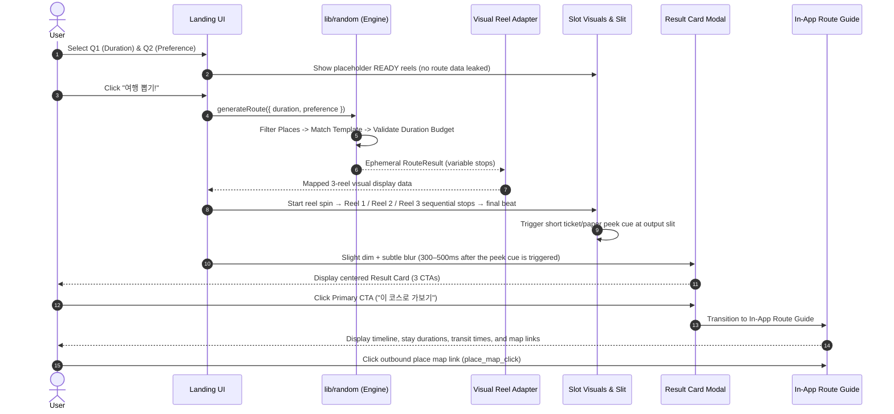
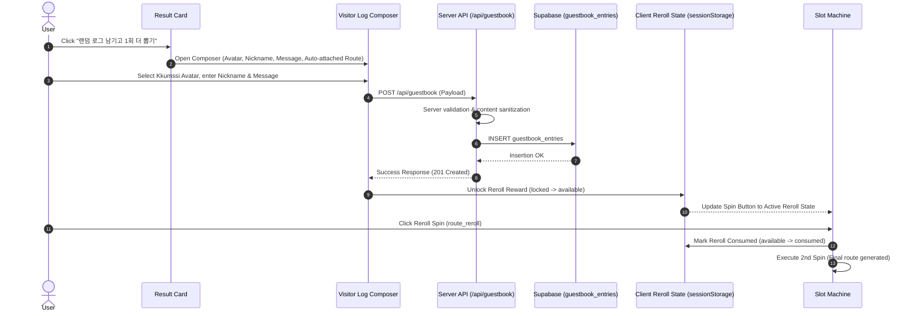
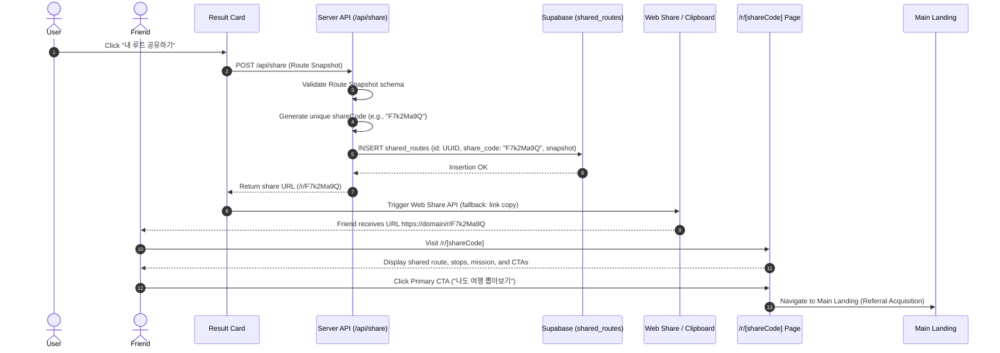

# Architecture Contract: Daejeon Random Trip

## 1. Technology Stack
- **Framework**: Next.js 16 (App Router)
- **UI Library**: React 19
- **Language**: TypeScript 5
- **Styling**: Tailwind CSS 4
- **Linter**: ESLint 9
- **Package Manager**: pnpm (tracked via `pnpm-workspace.yaml`, `packageManager`)
- **Runtime Target**: Node.js (tracked via `.node-version`)
- **Hosting Target**: Vercel
- **Persistence Target**: Supabase (PostgreSQL)
- **Telemetry**: Google Analytics 4 (GA4)

---

## 2. Directory Blueprint & Routing Architecture

```
src/
├── app/
│   ├── layout.tsx                # Global root layout, font tokens, metadata
│   ├── page.tsx                  # Main Landing (IA: Left, Center Experience, Right); force-dynamic (ADR-025)
│   ├── random-log/
│   │   ├── page.tsx              # Public Random Log board (list + cursor "Load more"); force-dynamic (ADR-025)
│   │   └── [id]/
│   │       └── page.tsx          # Public Random Log detail (noindex), via getGuestbookEntryByPublicId
│   ├── r/
│   │   └── [shareCode]/
│   │       └── page.tsx          # Dedicated shared route view (noindex)
│   └── api/                      # Route handlers for share snapshot & guestbook API boundaries
│       ├── guestbook/
│       │   └── route.ts          # Input validation, sanitization, DB insert; GET supports cursor pagination
│       └── share/
│           └── route.ts          # Snapshot validation, shareCode generation & DB insert
├── components/
│   ├── experience/               # Core slot machine, setup, result overlay
│   │   ├── SetupArea.tsx         # Q1, Q2, and READY status
│   │   ├── SlotAnchor.tsx        # Stationary slot chassis & animated reels
│   │   ├── ResultArea.tsx        # Centered focus Result Card overlay
│   │   └── ResultSheet.tsx       # Result Card body; independent Random Log / reroll CTA renderers (ADR-025)
│   ├── guide/                    # In-app structured route breakdown
│   │   ├── RouteGuideModal.tsx   # Portal-mounted modal (opened from the Result Card and /r/[shareCode])
│   │   └── RouteGuideTimeline.tsx# Ordered stop timeline, stay durations, tips, external map links
│   ├── share/                    # Referral / shared-route landing presentation
│   │   └── SharedRouteView.tsx   # /r/[shareCode] snapshot view + not-found state
│   ├── guestbook/                # Random Log writing form (Result-gated; no landing-page entry point)
│   │   ├── GuestbookComposer.tsx # In-flow modal opened from the Result Card; reward-eligible copy via a prop, never live reroll state (ADR-025)
│   │   └── CharacterSelector.tsx # Hero preview + fixed 5x2 picker over the 10 Kkumssi-family identities (ADR-025)
│   ├── random-log/               # Random Log public read surfaces (ADR-025)
│   │   ├── RandomLogRightRailPreview.tsx # Right sidebar live preview (top 3), reads the DB layer directly
│   │   ├── RandomLogList.tsx     # /random-log board: initial entries + client-owned "Load more"
│   │   ├── RandomLogCard.tsx     # Board card: character, nickname, timestamp, message excerpt, trip tags
│   │   ├── RandomLogDetail.tsx   # /random-log/[id] detail view + not-found state
│   │   ├── RandomLogAvatarBadge.tsx # Shared avatar_id -> imageSrc/badgeEmoji renderer
│   │   └── randomLogLabels.ts    # Zone/duration/preference label + KST-pinned timestamp helpers
│   ├── pick/                     # Today's Pick editorial banner (planned; not yet implemented)
│   │   └── TodaysPickWidget.tsx  # Right sidebar rotating pixel-art banner, optional external link
│   ├── sidebar/                  # MY PROFILE / TODAY'S PICK / VISITOR LOG (Random Log preview) widgets
│   │   ├── LeftSidebar.tsx       # MY PROFILE, TODAY IS…, BGM PLAYING widgets
│   │   └── RightSidebar.tsx      # TODAY'S PICK banner + live Random Log preview (RandomLogRightRailPreview)
│   └── layout/                   # Global shell: header, footer, decorative layer
│       ├── Header.tsx            # Retro browser-chrome bar; the address-bar pill doubles as a site-wide Home link
│       ├── Footer.tsx            # Minimal landing footer
│       └── AmbientDecorations.tsx# Decorative sparkle/cloud pixel elements
├── lib/
│   ├── random/                   # Controlled Random Travel engine, duration budgeting & template matching
│   ├── database/                 # Supabase client wrapper & server data access layer
│   └── analytics/                # GA4 event tracking helpers and parameter sanitizers
├── config/                       # Modifiable policies, avatar definitions, duration budgets
├── data/                         # Static seed data: picks.ts, places.ts, zones.ts, templates.ts
└── content/                      # Static copy, descriptions, and user-facing strings
public/                           # Static assets: pixel art, character illustrations, audio
```

---

## 3. Data Tiering & Persistence Architecture

The data architecture strictly separates ephemeral session computations from persistent community assets:

```
┌──────────────────────────────────────────────────────────────────────────┐
│ STATIC DATA TIER (src/data/, src/config/)                                │
│ - Today's Pick editorial banner (picks.ts) — planned, not yet implemented│
│ - Place Candidates, Zones, and Route Templates                           │
│ - Product Policies (Duration budgets, reroll limits, weights)            │
├──────────────────────────────────────────────────────────────────────────┤
│ CLIENT / ANONYMOUS SESSION TIER (sessionStorage / Browser Session)       │
│ - Q1 Duration & Q2 Preference State                                      │
│ - Active RouteResult (Variable 1–4 stops, duration calculation)          │
│ - In-App Route Guide State                                               │
│ - Reroll Reward State (locked → available → consumed)                    │
│   (Maintained across tab refreshes during active session; no user login) │
├──────────────────────────────────────────────────────────────────────────┤
│ PERSISTENT DATABASE TIER (Supabase via Server/API Boundary)              │
│ - guestbook_entries (Community logs + moderation status: visible/hidden) │
│ - shared_routes (Immutable snapshots referenced by /r/[shareCode])       │
└──────────────────────────────────────────────────────────────────────────┘
```

> **Formal Data Contract**: Detailed entity definitions and database schemas are formally specified in [`docs/DATA_MODEL.md`](./DATA_MODEL.md).

---

## 4. Sequence & Growth Loop Flows

### 4.1 Core Conversion & Route Guide Flow


### 4.2 Participation & 1-Time Reroll Reward Flow


> **After the reward is consumed (ADR-025)**: the 2nd (or any later) Result may still be logged — writing is gated on having an active Result, not on `Session`'s reward state. The Composer opens with non-reward copy ("랜덤 로그 남기기"), the write succeeds and appears on the public read surfaces below, and `Session` stays `consumed` — `unlockRerollReward`'s existing guard refuses to re-unlock, so this can never grant a second reward. The reroll CTA itself is hidden (not shown disabled) once `consumed`.
>
> **Public read surfaces are passive** and intentionally have no sequence diagram of their own: the Right Rail preview, `/random-log`, and `/random-log/[id]` are plain server-rendered reads of `guestbook_entries`, available before any spin, requiring no client action beyond navigation.

### 4.3 Referral Share Loop


---

## 5. Key Architectural Boundaries & Guardrails

### 1. Engine, Visual Reel Adapter, and READY Reel Separation
- The `lib/random` engine calculates the logical `RouteResult` independently of UI animations (randomness can be seeded or injected for automated testing).
- A visual adapter layer maps variable-stop `RouteResult` data into the visual reel display format consumed by the slot presentation.
- **READY State Guardrail**: Content displayed on reels in the READY state is presentation-only idle/placeholder content. It must **never** expose or leak the generated `RouteResult` before spin completion.
- The UI reveals the detailed itinerary via a 2-stage presentation only after all reels stop and the final beat finishes: (1) a brief ticket/paper peek cue at the slot output slit, followed (300–500ms after the peek cue is triggered) by (2) the front-facing centered Result Card overlay against a lightly dimmed/blurred backdrop.

### 2. Spin Action vs. Visual Lever Mechanism
- The fixed product behavior is the **Spin Action** (`“여행 뽑기!”`) and its corresponding state transition (`READY` → `SPIN` → `RESULT`).
- The lever is strictly an engaging visual interaction / feedback mechanism.
- The application must function reliably if lever animation fails, lever assets are changed, or the lever is removed in a future skin.
- The lever must **never** become a separate required action, a blocking prerequisite, or a second primary CTA.

### 3. Stationary Slot Anchor Boundary
- The Slot Anchor remains **completely stationary** across all lifecycle states (`Q1`, `Q2`, `READY`, `SPIN`, `RESULT`, `ROUTE_GUIDE`).
- No vertical translation, DOM pushing, or layout displacement occurs upon result generation.
- The output slit serves strictly as a physical reveal cue (a brief peek animation).

### 4. Result Card & Route Guide DOM Architecture
- All modal dialogs (`Result Card`, `Guestbook Composer`) and views (`Route Guide`, `/guestbook`, `/r/[shareCode]`) must be constructed in **semantic React / DOM / CSS**. Monolithic sliced image layouts are strictly prohibited.
- **Glassmorphism Prohibition**: Modals and cards must retain the approved retro / Korean Y2K / paper / arcade aesthetic (solid borders, tactile shadows, retro paper textures, stamps, washi tape). Modern frosted glassmorphism is prohibited.
- Backdrop blur is applied subtly and lightly (`backdrop-blur-sm` / slight dim) solely to direct visual focus.

### 5. Character Asset Boundary
- Character illustrations (e.g., Kkumdori / 꿈돌이 and Kkumssi Family) must remain **independent image assets/components**.
- Do **not** bake character artwork directly into panel, slot chassis, or background wallpaper artwork.
- The approved character assets in `public/` are the authoritative source of truth.

### 6. Duration Budgeting & Recommendation Engine Guardrails
- `src/lib/random` enforces duration budgets connected to Q1 choices (`half` vs. `full`).
- Route total travel time is calculated conceptually as: `∑ (Place Stay Durations) + ∑ (Inter-stop Travel Times)` and presented in casual, human-readable strings (`“약 4시간”`).
- Specific duration budget bounds are configurable in `src/config/` rather than hardcoded in engine logic; exact hour ranges will be calibrated once candidate place data is compiled.

### 7. Policy & Data Decoupling (No UI Hard-coding)
- **Product Policies** live in `src/config/`:
  - Maximum reroll limits
  - Available duration and preference choices
  - Zone eligibility rules
  - Special inclusion/weighting policies (e.g., Seongsimdang inclusion frequency)
  - Avatar list and duration budget thresholds
- **Places & Templates** live in `src/data/`.
- UI components must strictly consume configs and props; business constants must not be embedded directly into React components.

### 8. Persistence Layer & Server/API Access Boundary
- Persistent data interactions (`guestbook_entries`, `shared_routes`) are strictly encapsulated behind Server/API route handlers (`/api/guestbook`, `/api/share`) and `src/lib/database/`.
- UI components must **never** execute direct database writes or issue raw database queries.
- Reward rerolls are unlocked only after verified server-side validation and database insert success.

### 9. Today's Pick Static Boundary (Revised Scope — ADR-015)
- A Right Rail editorial / visual banner only — not a detail-page route, not a discovery funnel, not a Q2-seeding mechanism.
- Managed entirely in static data (`src/data/picks.ts`, currently `TODAYS_PICKS = []` — planned, not yet implemented) without dynamic server-side CMS dependencies.
- ~5 production pixel-art variants planned; displayed artwork may rotate by weekday or another simple schedule.
- A banner may optionally hyperlink to an external site related to the featured artwork/place/theme. No internal route or Q2 state is touched.

### 10. Analytics & Privacy Boundary
- Telemetry helpers in `src/lib/analytics/` sanitize and enforce safe non-PII parameters.
- Free-text strings (visitor nicknames, messages) and personal information (email, phone, demographics) are **never** transmitted to GA4.
- The application database does not collect or store persistent user IP profiles (while allowing transient infrastructure metadata processing for security and rate limiting).

### 11. Slot Visual Frame & Logical Canvas Separation
- `SlotVisualFrame` (`src/components/experience/SlotAnchor.tsx`) represents the physical visible slot machine footprint and participates in normal page layout flow. The original 600×500 asset coordinate system (`LogicalCanvas`) is absolutely positioned inside the frame and must never determine surrounding layout spacing (no negative-margin compensation).
- Verified geometry constants and formulas live in `src/components/experience/slotGeometry.ts`, not hardcoded inline in components. See ADR-020.

### 12. Ground Scenery Is Not Semantic Footer
- Decorative tower/city/foliage artwork anchored beneath the Visual Stage is Ground Scenery — structurally and semantically distinct from the `Footer` component. `Footer` is intentionally excluded from the initial landing Hero. See ADR-021.

### 13. SlotOutputLayer Reserved as a Sibling, Not a Descendant
- The future Result/Ticket output reveal (ADR-008) mounts inside `SlotStage` as a sibling of `SlotVisualFrame`, never inside `LogicalCanvas` or subject to the frame's `overflow: hidden` clip. See ADR-022.

### 14. Random Log: Public Read / Result-Gated Write / Reward Decoupling Boundary
- Random Log **reading** (Right Rail preview, `/random-log`, `/random-log/[id]`) is public and ungated — available before any spin, never conditioned on `phase === 'result'` or any session state.
- Random Log **writing** is gated on having an active generated Result (no landing-page write entry point) and capped at one submission per Result within the current mounted client session — a plain, unpersisted React state guardrail (`loggedRouteIds` in `MainExperience`), not a DB constraint.
- Writing eligibility and reroll reward eligibility (ADR-011) are **independent state machines** — never re-coupled into one CTA switch. `GuestbookComposer` receives reward context as an explicit prop (`rewardEligible`), and snapshots it at submit time rather than reading it live afterward, so its success copy always reflects what that specific submission actually granted.
- The `/random-log/[id]` public identifier reuses the existing `guestbook_entries.id` UUID directly (no migration, no new column), reached only through the `getGuestbookEntryByPublicId` data-access boundary — never an inline query — so the identifier scheme can evolve later without touching UI or routes.
- `export const dynamic = 'force-dynamic'` is required on `/` and `/random-log`: Next.js 16.3.2 does not infer dynamic rendering from an uncached `fetch()` alone on a route with no dynamic segment.
- See ADR-025 for the full contract and rationale, including the explicit MVP abuse-boundary scope (client UX guardrail, not a security control; no auth, device identity, reward ledger, DB uniqueness, or rate limiting).

### 15. Motion Preference: Shared Lifecycle Clock, CSS-Only Reduced Intensity
- The SPINNING → RESULT product lifecycle is driven exclusively by `setTimeout` beats in `MainExperience.tsx`, never by `animationend`/`transitionend` or any other coupling to CSS animation completion. `prefers-reduced-motion` selects **which timing table** drives that single lifecycle (`getMotionTimings()` in `motionConfig.ts`, returning `MOTION_TIMINGS` or `REDUCED_MOTION_TIMINGS`) — it must never select a shortened or skipped lifecycle.
- Visual motion intensity for `prefers-reduced-motion: reduce` is adjusted **only** in `src/app/globals.css`, inside the existing `@media (prefers-reduced-motion: reduce)` block, as `animation-duration` overrides on the same classes/keyframes normal motion uses. Reduced motion must reuse the existing reel DOM, track, and roll metaphor at lower velocity — introducing a distinct visual metaphor (e.g., a symbol-shuffle/crossfade system) for reduced motion is out of scope; the approved full-motion Slot animation is the single visual source of truth for both motion preferences.
- See ADR-026.
