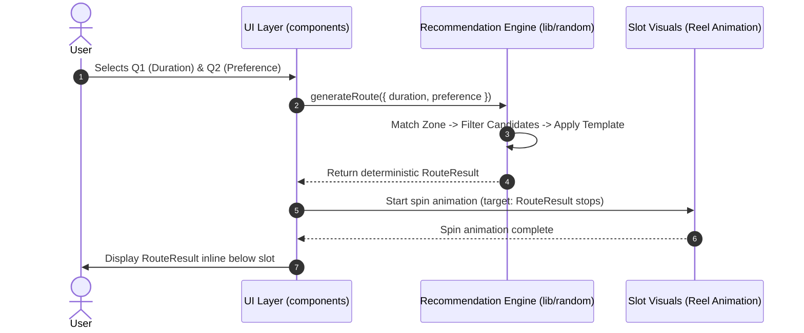
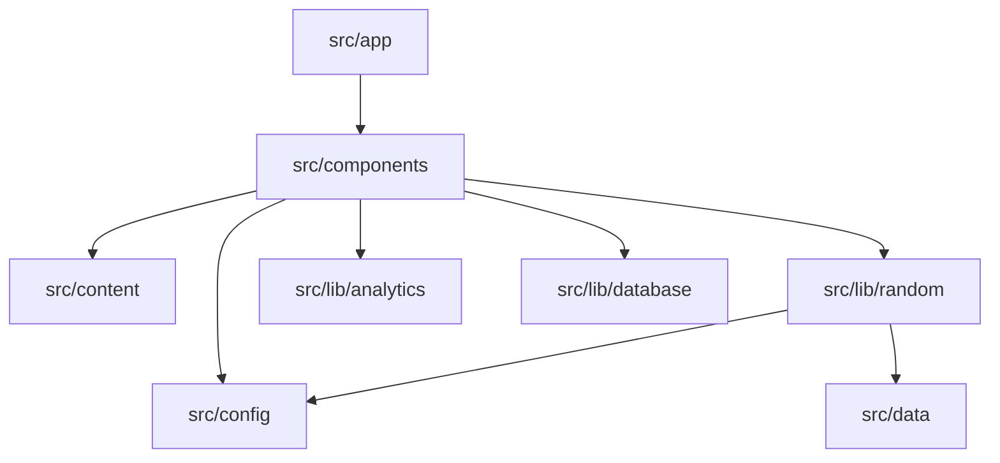

# Architecture Contract: Daejeon Random Trip

## 1. Technology Stack
- **Framework**: Next.js 16 (App Router)
- **UI Library**: React 19
- **Language**: TypeScript 5
- **Styling**: Tailwind CSS 4
- **Linter**: ESLint 9
- **Package Manager**: pnpm (tracked via `pnpm-workspace.yaml`, `packageManager`)
- **Runtime Target**: Node.js (tracked via `.node-version`)
- **Hosting Target**: Vercel (future)
- **Persistence Target**: Supabase (future)
- **Telemetry**: Google Analytics 4 (GA4)

---

## 2. Module Responsibilities & Directory Blueprint

```
src/
├── app/                  # Next.js App Router pages, layouts, and route handlers
├── components/           # Reusable UI components (Slot, Layout, RouteView, Guestbook)
├── lib/
│   ├── random/           # Controlled Random Travel engine & candidate matching logic
│   ├── analytics/        # GA4 event tracking helpers and parameter sanitizers
│   └── database/         # Data access layer & Supabase client wrapper (future)
├── config/               # Modifiable product policies (reroll limits, options, weighting)
├── data/                 # Seed data: Zones, route templates, candidate place data
└── content/              # Static copy, descriptions, and user-facing text strings
public/                   # Static media: pixel art, character illustrations, audio
```

---

## 3. Conceptual Data Models & Recommendation Flow

### Data Models (Conceptual Contract)
```typescript
interface RouteResult {
  id: string;
  zone: string;
  durationType: 'half' | 'full';
  preference: 'anything' | 'food' | 'walk' | 'photo';
  stops: RouteStop[];
  mission?: string;
  createdAt: string;
}

interface RouteStop {
  order: number;
  placeId: string;
  name: string;
  category: string;
  durationMin: number;
  travelMin: number;
}

interface PlaceCandidate {
  id: string;
  name: string;
  category: string;
  zoneId: string;
  durationMin: number;
  tags: string[];
  soloFriendly: boolean;
  address?: string;
  mapUrl?: string;
  image?: string;
  description?: string;
  active: boolean;
}
```

> **Note**: Stop count is flexible across templates and durations, never locked to a hard-coded length of 3.

### Flow Separation


---

## 4. Key Architectural Boundaries & Guardrails

### 1. Engine vs. Visual Reel Separation
- The `lib/random` engine calculates the logical `RouteResult` independently of any animations.
- The slot component receives the computed outcome and orchestrates the visual spinning animation to align with the result.
- The UI reveals the detailed itinerary only after the reels come to a stop.

### 2. Policy & Data Decoupling (No UI Hard-coding)
- **Product Policies** live in `src/config/`:
  - Maximum reroll limits
  - Available duration and preference choices
  - Zone eligibility rules
  - Special inclusion/weighting policies (e.g., Seongsimdang inclusion frequency)
- **Places & Templates** live in `src/data/`.
- UI components must strictly consume configs and props; business constants must not be embedded directly into React components.

### 3. Analytics & Privacy Boundary
- Telemetry helpers reside solely in `src/lib/analytics/`.
- **Absolute Rule**: Free-text fields (guestbook nicknames, messages) and personal information must never pass into GA4 events.

### 4. Persistence Layer (Supabase Future Boundary)
- Data interactions (guestbook entries, saved route snapshots) will be encapsulated within `src/lib/database/`.
- Components must never issue raw database queries directly; they interact through structured access functions.

### 5. Design & Asset Implementation Boundary
- **Code / DOM Responsibilities**: Layout structure (retro 3-column desktop layout), typography, buttons, interactive reel windows, route stops, guestbook form, dynamic state.
- **Static Assets (`public/`)**: Character artwork (Dreamdori/Kkumdori), pixel-art scenery/skyline, decorative stickers, complex illustrations, and audio effects.
- Visual dimensions and layout remains flexible to accommodate incoming design refinements.

---

## 5. Dependency Flow

- Core engine (`lib/random`) has zero dependency on React DOM or UI components.
- No runtime LLM dependency is used or required for route generation.
