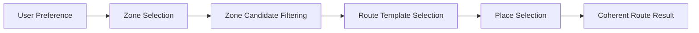

# Product Contract: Daejeon Random Trip

## 1. Mission & Objective
- **Mission**: Help move people to Daejeon through a real performance-marketing campaign.
- **Project Scope**: A lightweight MVP to deploy a live landing page, acquire real marketing traffic, measure user behavior with GA4, and analyze campaign conversion.
- **Core Value Proposition**: Reduce travel-planning friction by offering **Controlled Random Travel** that generates an instant, coherent day-trip itinerary.

---

## 2. Problem Statement
> *“I want to go somewhere, but even deciding where to go and planning the route feels like work.”*

Travelers often suffer from decision fatigue when selecting destinations, matching schedules, and stringing together places into a realistic route.

---

## 3. Product Mechanism: Controlled Random Travel
This product does not generate pure, unconstrained random noise. Instead, it follows a structured recommendation flow:

- **Zone**: A walkable/travelable neighborhood or tourism cluster (initial focus centered around Daejeon Station / old downtown).
- **Engine vs. UI**: The **Recommendation Engine** handles logic and route coherence. The **Slot Machine** is solely an engaging visual interaction layer.
- **Flexible Stops**: Route stop count is flexible rather than hard-coded to a fixed number.

---

## 4. Current UX Direction (Tentative v0.4)

### Setup & Interaction Flow
1. **Q1 (Duration)**: Local travel time in Daejeon (`Half Day` / `Full Day`)
2. **Q2 (Preference)**: Travel preference (`Anything` / `Food` / `Walk` / `Photo`)
3. **READY**: Transition into spin state.
4. **SLOT SPIN**: Visual reel animation matching the selected criteria.
5. **RESULT**: Appears **inline below the slot** once reels finish spinning.
6. **PRIMARY CTA**: Actionable route execution step.
7. **SECONDARY ACTIONS**: Share route or Reroll.

### Core UX Principles
- **Step-by-step simplicity**: One question at a time; avoids feeling like a tedious multi-field form.
- **Zero friction**: No unnecessary intermediate "Confirm" or "Next" buttons between simple choices.
- **Slot stability**: The slot machine remains in a consistent viewport position across Q1, Q2, and READY.
- **Inline presentation**: The result unfolds inline below the slot rather than locking the screen with a permanent blocking modal.
- **CTA Hierarchy**:
  - **Primary**: `“이 코스로 가보기”` (Start / Map / Go with this course)
  - **Secondary**: `“내 루트 공유하기”` (Share my route)
  - **Tertiary**: `“다시 뽑기”` (Reroll)
- **Guestbook**: Secondary engagement feature; does not interrupt or block the core travel funnel.

---

## 5. Scope Boundaries

### In-Scope (MVP)
- Landing page with responsive retro/Y2K desktop 3-column identity.
- Controlled random route generation engine.
- Interactive slot machine reel animation.
- Dynamic route display with stop details and mission.
- Simple guestbook (nickname + short message + auto-attached route snapshot; no user signup).
- GA4 event tracking and campaign parameter collection.
- Primary proxy conversion CTA linking out to navigation/maps.

### Explicitly Out-of-Scope (MVP)
- Runtime LLM / AI-generated travel routes.
- User account creation, authentication, or profile management.
- Direct physical GPS check-in or visit verification.
- Citywide comprehensive tourism database (initial focus limited to key clusters).
- Whole-image PNG page slicing (UI elements must be semantic DOM/code).
- Manual route transcription in the guestbook (must be automated via snapshot).

---

## 6. Hypotheses vs. Confirmed Decisions

| Item | Status | Details |
| :--- | :--- | :--- |
| **Controlled Randomness** | **Confirmed** | Structured recommendation flow separated from visual reel animation. |
| **Proxy Conversion Model** | **Confirmed** | Map/course click (`route_map_click`) serves as high-intent proxy for physical travel. |
| **No Runtime LLM** | **Confirmed** | Deterministic/seeded template matching for speed and reliability. |
| **Target Demographic (20–30s)** | *Working Hypothesis* | Operational target for marketing copy/ads; not a validated product constraint. |
| **v0.4 2-Question Flow** | *Tentative* | Subject to adjustment based on user testing and team review. |
| **Initial Zone Coverage** | *Tentative* | Centered on Daejeon Station / old downtown; expandable post-MVP. |

---

## 7. Success Behavior
- Real visitors from performance marketing complete the preference questions without drop-off.
- The slot machine delivers a believable, appealing route within seconds.
- High conversion on the primary CTA (`route_map_click`), indicating clear intent to travel.
- Route sharing and guestbook snapshots function smoothly without collecting personal identifiable information (PII).
