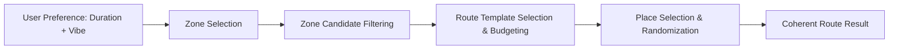

# Product Contract: Daejeon Random Trip

## 1. Mission & Product Positioning
- **Mission**: Help move people to Daejeon through a real performance-marketing campaign.
- **Core Message**: **“계획하지 말고, 대전에서 여행을 뽑아보자.”** (Don't plan, draw a trip in Daejeon!)
- **Service Identity**: This product is **not** a general tourism portal, restaurant ranking directory, or travel scrapbook ("내 보관함"). It avoids shifting the burden of planning back onto the user.
- **Four Value Pillars**: Every feature must contribute to at least one of the following:
  1. **Spin Conversion**: Quick progression through Q1/Q2 into slot spin.
  2. **Real Travel Intent**: Guiding the user from a coherent route result to tangible travel actions via Route Guide and map links.
  3. **Participation & Social Proof**: Lowering psychological barriers via Visitor Logs and rewarding participation with a 1-time reroll unlock.
  4. **Referral Acquisition**: Organic virality through immutable route snapshots shared directly with friends (`/r/[shareCode]`).

---

## 2. Problem Statement & Mechanism

### Problem Framing
Potential visitors often experience decision fatigue when planning short trips—sorting through numerous recommendations, coordinating schedules, and assembling individual stops into a coherent route. The product hypothesis is that providing a low-friction, curated random route generator reduces planning hesitation and encourages spontaneous local exploration in Daejeon.

### Product Mechanism: Controlled Random Travel


- **Zone**: Walkable/travelable neighborhood cluster (initial focus centered around Daejeon Station / old downtown: Eunhaeng-dong & Daeheung-dong).
- **Engine vs. UI**: The **Recommendation Engine** (`src/lib/random`) handles candidate filtering, random selection, template matching, and route validation. The **Slot Machine** is solely an animated visual interaction layer.
- **Stop Count & Sequence Policy**:
  - **Half-Day (`half`)**: Fixed **exactly 3 stops** (`Meal → Cafe → Preference`). (2-stop routes are deprecated).
  - **Full-Day (`full`)**: **3–4 stops** (primary **4 stops**: `Meal → Cafe → Discovery → Preference`; graceful fallback to **3 stops**: `Meal → Cafe → Preference`, omitting Discovery while preserving the user's selected Preference).
- **Duration Budgeting**: Numeric minute bounds remain unconfigured (TBD) pending transit modeling and verified candidate place data. In provisional MVP data, `estimatedTotalMinutes` represents place stay duration.


---

## 3. Three Core Growth Loops

```
1. CORE CONVERSION LOOP
   Landing (Q1/Q2) ──► Slot Spin ──► Result Card ──► Route Guide ──► Outbound Map Action

2. PARTICIPATION & REWARD LOOP
   Result Card ──► Visitor Log Composer ──► Server Validation & DB Save ──► Reroll Unlocked ──► Second Spin

3. REFERRAL LOOP
   Result Card ──► Share Route ──► /r/[shareCode] ──► Friend Reads ──► "나도 여행 뽑아보기" ──► New Landing User
```

> **Today's Pick is not a growth loop.** It is a simple Right Rail editorial / visual banner (see §6.4) — it does not feed into or seed the Slot, and has no detail-page or funnel of its own.

---

## 4. Main Landing Information Architecture (IA)

### Layout Overview (Visual v4 Base)
- **Top Navigation Elimination**: Legacy top navigation/tabs (`여행 뽑기`, `가이드`, `맛집 리스트`, `내 보관함`) are **deleted**. Eliminating tabs recovers vertical space, allowing the `Setup Area` and `Slot Anchor` to sit prominently in the initial viewport.
- **Section Roles**:
  - **LEFT SIDEBAR (World-building & Retro Y2K Widgets)**:
    - `MY PROFILE`: Kkumdori (꿈돌이) character identity & world-building note.
    - `TODAY IS…`: Playful daily mood memo.
    - `BGM PLAYING`: Retro web player widget (purely ambient; no standalone subpage).
  - **CENTER (Core Conversion Engine)**:
    - `Setup Area` (Q1 Duration → Q2 Preference → READY state).
    - `Slot Anchor` (Stationary slot machine hero & reel animation).
    - `Result Overlay` (Front-facing centered Result Card modal triggered post-spin).
    - `Route Guide` (In-app itinerary breakdown viewed upon clicking `“이 코스로 가보기”`).
  - **RIGHT SIDEBAR (Content Discovery & Social Proof)**:
    - `TODAY’S PICK`: Editorial banner featuring rotating pixel artwork (~5 production variants); no detail page.
    - `VISITOR LOG`: Preview showing the latest ~3 visible Visitor Log entries with a link to `/guestbook`.

---

## 5. Interaction & Experience Contracts

### 5.1 Spin & Result Reveal Sequence
1. **Q1 (Duration)**: Local Daejeon travel time (`Half Day` / `Full Day` — time spent in Daejeon).
2. **Q2 (Preference)**: Travel vibe (`Anything` / `Food` / `Walk` / `Photo`).
3. **READY**: Idle placeholder reels; primary CTA activates `“여행 뽑기!”`.
4. **SPINNING**: Reels roll concurrently; sequential stop (`Reel 1` → `Reel 2` → `Reel 3` → short final beat).
5. **PEEK CUE & RESULT REVEAL**:
   - **Physical Peek Cue**: Immediately following the final beat after Reel 3 stops, a short ticket/paper peek animation appears at the stationary slot output slit as a physical dispensing affordance.
   - **Centered Focus Overlay**: 300–500ms after the peek cue is triggered, the background landing page is slightly dimmed with a subtle backdrop blur, and the front-facing **Result Card** appears in the center of the viewport.

### 5.2 Result Card Action Hierarchy
The Result Card displays the route title (e.g., `“오늘은 대흥동 먹방 코스!”`), STOP 1~4 details, and optional mission. It offers three distinct action paths:

1. **Conversion (Primary)**: `“이 코스로 가보기”`
   - Transitions directly to the in-app **Route Guide** for structured itinerary guidance.
2. **Referral (Secondary)**: `“내 루트 공유하기”`
   - Generates an immutable snapshot in `shared_routes`, generates a short lookup code (`/r/[shareCode]`), and triggers Web Share API (with clipboard copy fallback).
3. **Participation / Reward (Tertiary)**: `“랜덤 로그 남기고 1회 더 뽑기”`
   - Opens the Visitor Log composer in-flow. Upon successful server validation and DB save, unlocks 1 reward reroll.

---

## 6. Feature Specifications

### 6.1 In-App Route Guide
- **Concept**: Rather than immediately tossing users out to an external map, clicking `“이 코스로 가보기”` opens the in-app Route Guide to provide structured route context.
- **Route Guide Content**:
  - Route title & stop count summary (Half-day: fixed 3 stops; Full-day: 3–4 stops).
  - **Total Estimated Travel Time**: Formatted casually (e.g., `“약 4시간”`, `“약 5시간 30분”`), calculated conceptually as: `∑ (Place Stay Durations) + ∑ (Inter-stop Travel Times)`. (Note: In MVP provisional data, `estimatedTotalMinutes` reflects place stay durations only; numeric duration budget bounds remain unconfigured/TBD pending transit modeling).
  - **STOP Timeline**: Place name, category, estimated stay time, inter-stop transit mode & time, playful tips/cautions, and individual outbound map links (`mapLinks` for Naver / Kakao Map).
- **Explicit Exclusions**: Embedded map SDKs, real-time GPS turn-by-turn navigation, real-time wait times, and place-swapping customization are omitted to prevent decision fatigue.

### 6.2 Guestbook / Visitor Log & 1-Time Reroll Reward
- **Visitor Log Role**: Delivers social proof and incentivizes participation.
- **Composer UX**: Opens exclusively within the Result Card flow (`“랜덤 로그 남기고 1회 더 뽑기”`). `/guestbook` serves as the dedicated social proof archive and full log stream (read-only archive, no standalone composer on `/guestbook`).
- **Input Fields & Constraints**:
  - **Avatar**: Selectable Kkumssi Family avatar (mandatory; shared asset IDs across preview and `/guestbook`).
  - **Nickname**: 2–12 characters (sanitized).
  - **Message**: Max 50 characters (one-liner, sanitized).
  - **Route Info**: Automatically attached route reference metadata from active `RouteResult` (`route_id`, `zone_id`, `duration_type`, `preference_type`).
  - **PII Prohibition**: No phone, email, age, or gender fields.
- **Reroll Reward Lifecycle**:
  - Replaces the deprecated "1 free reroll for everyone" policy.
  - Lifecycle: `locked` → `available` → `consumed`.
  - **Unlock Rule**: Unlocks **only** after server validation and successful DB insertion into `guestbook_entries`.
  - **Cap & Persistence**: Maximum 1 reward reroll per travel session, backed by browser `sessionStorage`. Additional guestbook submissions never grant additional rerolls.

### 6.3 Referral Share & Shared Route Page (`/r/[shareCode]`)
- **Referral Mechanism**:
  - Generates an immutable snapshot in `shared_routes` via server API and yields a clean URL (e.g., `https://domain/r/F7k2Ma9Q`). Full route data is **never** serialized into URL query strings.
  - Repeated share clicks on the same result reuse the generated `shareCode`.
  - Sharing invokes native `navigator.share` (Web Share API) where supported, falling back to clipboard link copying. Kakao SDK / Login is omitted.
- **Shared Route View (`/r/[shareCode]`)**:
  - Standalone dedicated view optimized for friends receiving a route.
  - Header hook: `“누군가 대전 여행을 보냈어요!”` + Route Title + STOP sequence + Mission.
  - **Primary CTA**: `“나도 여행 뽑아보기”` (Redirects to Main Landing to acquire new user).
  - **Secondary CTA**: `“이 코스 그대로 가보기”` (Opens Route Guide).
  - **SEO & Fallback**: Marked `noindex` by default. Invalid/missing codes present a friendly fallback with `“내가 새 여행 뽑기”`.
- **Open Graph Protocol**:
  - Referral MVP sequence: 1. DB snapshot save, 2. `/r/[shareCode]`, 3. Web Share + copy fallback, 4. Default OG meta tags.
  - Dynamic OG image generation is a high-priority non-blocking enhancement within MVP scope.

### 6.4 Today's Pick (Right Rail Editorial Banner) — Revised Scope (ADR-015)
- **Concept**: A simple Right Rail editorial / visual banner surface. It is **not** a detail-page flow, a discovery funnel, or a Q2-seeding mechanism.
- **Artwork**: Approximately 5 production pixel-art variants are planned. The displayed artwork may rotate by weekday or another simple schedule (exact mechanism TBD).
- **Optional External Link**: A banner may optionally hyperlink to an external site related to the featured artwork/place/theme.
- **Explicit Exclusions**: No dedicated `/pick/[slug]` detail page. No Q2 preference-seeding CTA. No Today's Pick → Slot funnel.
- **Data Management**: 100% static TypeScript data (`src/data/picks.ts`); no Supabase or CMS overhead. *(Status: planned — `TODAYS_PICKS` is currently an empty array; not yet implemented.)*

---

## 7. Scope Boundaries

### In-Scope (MVP)
- Main Landing page built on the approved Visual v4 Base without top navigation tabs.
- Controlled random route generation engine with duration budgeting.
- Stationary slot machine animation with output slit peek cue.
- Centered focus Result Card overlay with 3-action hierarchy.
- In-app Route Guide with duration calculations and outbound place map links.
- Visitor Log (Landing preview + `/guestbook` read-only archive + in-flow composer with Kkumssi family avatars).
- 1-Time Reroll Reward unlocked via successful server validation and guestbook DB submission.
- Referral Share with server snapshot storage and dedicated `/r/[shareCode]` page.
- Today's Pick Right Rail editorial banner (~5 rotating pixel-art variants; optional external hyperlink; no detail page, no Q2 seeding).
- GA4 telemetry tracking across all 3 growth loops with strict PII prohibition.

### Explicitly Out-of-Scope (MVP)
- Top navigation tabs (`가이드`, `맛집 리스트`, `내 보관함`).
- User account creation, authentication, login systems, or persistent user profiles.
- Runtime LLM / AI route generation.
- Embedded interactive map SDKs (Naver/Kakao Maps JS SDKs) and real-time GPS navigation.
- Real-time business hours, dynamic table booking, or live wait-time checking.
- Itinerary spot swapping or custom route editing (prevents decision fatigue).
- Kakao SDK, Kakao Login, or Kakao Talk messaging API integration.
- CMS / Supabase storage for Today's Pick (must remain static TS data).
- **Today's Pick `/pick/[slug]` detail page** (revised out of scope, ADR-015).
- **Today's Pick Q2 preference-seeding CTA** (revised out of scope, ADR-015).
- **Today's Pick → Slot funnel** of any kind (revised out of scope, ADR-015).
- Full-screen image slicing (all UI panels and Result Card body must remain semantic React/DOM/CSS).

---

## 8. Decisions & Hypotheses Status

| Item | Status | Details |
| :--- | :--- | :--- |
| **Controlled Random Travel** | **Fixed Product Decision** | Structured recommendation flow separated from visual slot animation. |
| **Three Core Growth Loops** | **Fixed Growth Decision** | Core Conversion, Participation & Reward, and Referral. Today's Pick is a separate Right Rail editorial banner, not a growth loop. |
| **In-App Route Guide** | **Fixed Product Decision** | Result CTA opens in-app Route Guide before external map redirection. |
| **1-Time Reroll Reward** | **Fixed Product Decision** | Replaces free reroll; unlocks 1 reroll upon guestbook DB submission. |
| **Referral Snapshot Model** | **Fixed Architecture Decision** | Immutable snapshots in `shared_routes` accessed via `/r/[shareCode]`. |
| **Today's Pick Editorial Banner** | **Fixed Content Decision** | Static TS data; ~5 rotating pixel-art variants; optional external hyperlink. No detail page, no Q2 seeding, no Slot funnel (ADR-015, revised). |
| **Top Nav Elimination** | **Fixed Layout Decision** | Top tabs removed to maximize viewport priority for Setup & Slot Anchor. |
| **Proxy Conversion Model** | **Fixed Measurement Decision** | Route Guide map clicks (`place_map_click`) serve as the primary high-intent proxy metric. Today's Pick banner-click tracking is TBD/deferred (see `docs/ANALYTICS.md`). |
| **No Runtime LLM / No PII** | **Fixed Engineering Decision** | Curated static seed templates; zero PII or free-text in GA4. |
| **Target Demographic (20–30s)** | *Working Hypothesis* | Operational target for marketing copy/ads; not a rigid product limit. |
| **Initial Zone Coverage** | *Tentative* | Centered on Daejeon Station / old downtown; expandable post-MVP. |

---

## 9. Success Behavior & Measurable Signals
- **Setup Funnel Progression**: User progression through Q1/Q2 to READY produces clear completion and drop-off metrics in GA4.
- **Recommendation & Spin Experience**: The recommendation engine and slot animation deliver a coherent itinerary with acceptable perceived latency without blocking runtime delays.
- **Primary Proxy Conversion**: Clicks on outbound map links within the in-app Route Guide (`place_map_click`) serve as the primary proxy conversion indicating high travel intent. Today's Pick banner-click tracking is TBD/deferred until the banner's actual implementation is designed.
- **Participation & Referral Loops**: Visitor log submissions (`guestbook_submit`) and route sharing completions (`route_share_complete`) operate seamlessly with zero PII or free-text leakage into analytics.
- **Honest Metric Evaluation**: Map clicks represent high-intent interest and are not conflated with guaranteed physical travel attendance.
