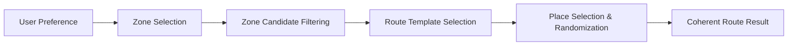

# Product Contract: Daejeon Random Trip

## 1. Mission & Objective
- **Mission**: Help move people to Daejeon through a real performance-marketing campaign.
- **Project Scope**: A lightweight MVP to deploy a live landing page, acquire real marketing traffic, measure user behavior with GA4, and analyze campaign conversion.
- **Core Value Proposition**: Reduce travel-planning friction by offering **Controlled Random Travel** that generates coherent short-trip routes within Daejeon (local itinerary for time spent in Daejeon).

---

## 2. Problem Statement (Synthesized Framing)
**Synthesized Problem Hypothesis**:
Potential visitors often experience decision fatigue when planning short trips—sorting through numerous recommendations, coordinating schedules, and assembling individual stops into a coherent route. The product hypothesis is that providing a low-friction, curated random route generator reduces planning hesitation and encourages spontaneous local exploration in Daejeon.

---

## 3. Product Mechanism: Controlled Random Travel
This product does not generate pure, unconstrained random noise. Instead, it follows a structured recommendation flow:

- **Zone**: A walkable/travelable neighborhood or tourism cluster (initial focus centered around Daejeon Station / old downtown).
- **Engine vs. UI**: The **Recommendation Engine** handles filtering, random selection, template matching, and route validation. The **Slot Machine** is solely an engaging visual interaction layer.
- **Flexible Stops**: Route stop count is flexible across templates rather than hard-coded to a fixed number.

---

## 4. Current UX & Visual Direction (Visual v4 Base)

### Visual Identity Base
- **Visual Direction**: "Korean Y2K Personal Web × Random Travel Toy" — an approved visual implementation base (subject to styling and polish refinements; structural product logic remains independent from visual skinning).
- **Current Naming & Layout Structure (v4)**:
  - **Header / Brand**: `DAEJEON RANDOM TRIP`
  - **Left Sidebar**: `DAEJEON GUIDE` (Dreamdori guide / world-building widget), `TRIP MIX` (music / ambient world-building widget), small memo/world-building content
  - **Center Main Experience**: `Setup Area` (Q1 / Q2 / READY status) → `Slot Anchor` (Slot Machine / "여행 뽑기" hero) → `Result Area` (inline generated route result)
  - **Right Sidebar**: `DAEJEON PICK` (featured Daejeon destination/spot content), `RANDOM LOG` (shared route / social-proof presentation)
  - *Naming Guidance*: Neutral domain terminology is preferred for architectural and data models. Avoid direct legacy vocabulary (`Profile`, `BGM`, `Guestbook`, `Minihome`, `TODAY / TOTAL`).
  - *Analytics Contract*: `RANDOM LOG` is a user-facing visual/presentation rename of the existing shared-route / guestbook concept. This visual rename does not change existing GA4 telemetry event names (e.g., `guestbook_open`, `guestbook_submit`), which remain governed by `docs/ANALYTICS.md`.

### Setup & Interaction Flow (Tentative)
1. **Q1 (Duration)**: Local travel time in Daejeon (`Half Day` / `Full Day` — representing local time in Daejeon, not origin travel time).
2. **Q2 (Preference)**: Travel preference (`Anything` / `Food` / `Walk` / `Photo`).
3. **READY**: Transition into spin-ready state with placeholder idle reels. Primary Spin Action: `“여행 뽑기!”`.
4. **SLOT SPIN**: Visual reel animation matching the selected criteria. The lever serves as an optional visual interaction/feedback mechanism; the spin action and state transition remain fully functional regardless of lever presence or animation state.
5. **RESULT**: Appears **inline below the slot anchor** once reels finish spinning.
6. **CTA Hierarchy**:
   - **Primary**: `“이 코스로 가보기”` (Start / Map / Go with this course — high-intent proxy)
   - **Secondary**: `“내 루트 공유하기”` (Share my route — opens RANDOM LOG note composer)
   - **Tertiary**: `“다시 뽑기”` (Reroll)

### Layout Concept & Visual Stability
- **Layout Concept**: `Setup Area` → `Slot Anchor` → `Result Area`
- **Slot Stability**: The Slot Anchor remains visually stable across Q1, Q2, READY, SPIN, and RESULT states to minimize layout shift (without imposing rigid pixel-coordinate constraints).
- **Inline Presentation**: The result unfolds inline below the slot rather than locking the screen with a permanent blocking modal.

### RANDOM LOG (Shared Route Stream)
- **Concept**: RANDOM LOG is the existing shared-route note concept presented through the v4 visual language, **not** a new feed product, operator-curated feed, or automatic recommendation feed.
- **Submission Flow**:
  1. User views generated Route Result.
  2. User clicks `“내 루트 공유하기”` (result generation does **not** automatically open the composer).
  3. Note composer opens / becomes active (presentation depends on viewport/layout, e.g. activating/focusing the composer on desktop or scrolling/opening on mobile; not hard-coded as a modal or drawer).
  4. User enters nickname + short message.
  5. Current `RouteResult` snapshot is automatically attached.
  6. On submit, the shared route card + message appears in the `RANDOM LOG` list.
- **Feature Scope & Analytics**: GA4 telemetry event names (such as `guestbook_open`, `guestbook_submit`) remain governed by `docs/ANALYTICS.md`. Reactions/likes are explicitly out of MVP scope.

---

## 5. Scope Boundaries

### In-Scope (MVP)
- Landing page built upon the approved Visual v4 Base ("Korean Y2K Personal Web × Random Travel Toy").
- Controlled random route generation engine (candidate filtering, random selection, template matching, route validation).
- Interactive slot machine reel animation with variable-stop adapter and placeholder READY reels.
- Primary spin action (`“여행 뽑기!”`) with optional visual lever feedback.
- Dynamic route display with stop details and mission, mounting inline below the slot.
- RANDOM LOG shared-route notes (nickname + short message + auto-attached route snapshot; no user signup).
- GA4 event tracking and campaign parameter collection.
- Primary proxy conversion CTA linking out to navigation/maps.

### Explicitly Out-of-Scope (MVP)
- Runtime LLM / AI-generated travel routes.
- User account creation, authentication, or profile management.
- Direct physical GPS check-in or visit verification.
- Citywide comprehensive tourism database (initial focus limited to key clusters).
- Whole-screen image slicing (UI elements, text, buttons, and characters must remain semantic DOM/code and independent modular assets).
- Manual route transcription in RANDOM LOG (must be automated via snapshot).
- Operator-curated feeds, automatic recommendation feeds, or like/reaction counters in RANDOM LOG.

---

## 6. Decisions & Hypotheses Status

| Item | Status | Details |
| :--- | :--- | :--- |
| **Controlled Random Travel** | **Fixed Product Decision** | Structured recommendation flow separated from visual reel animation. (Mechanism choice is fixed; conversion effectiveness is an unvalidated hypothesis to measure via campaign). |
| **Proxy Conversion Model** | **Fixed Measurement Decision** | Map navigation click (`route_map_click`) serves as high-intent proxy metric for physical travel interest. |
| **No Runtime LLM** | **Fixed Architecture Decision** | Static curated templates, candidate place data, and controlled random selection for speed, cost control, and reliability. |
| **Visual v4 Base** | **Approved Visual Base** | "Korean Y2K Personal Web × Random Travel Toy" base identity; subject to ongoing styling/polish refinements while decoupling structural logic from visual skins. |
| **Target Demographic (20–30s)** | *Working Hypothesis* | Operational target for marketing copy/ads; not a validated product constraint. |
| **v0.4 2-Question Flow** | *Tentative* | Subject to adjustment based on user testing and campaign funnel drop-off data. |
| **Initial Zone Coverage** | *Tentative* | Centered on Daejeon Station / old downtown; expandable post-MVP. |
| **RANDOM LOG Snapshot Model** | *Tentative* | Secondary engagement feature for sharing route snapshots with a message; no separate feed or user accounts. |

---

## 7. Success Behavior & Measurable Signals
- **Setup Funnel**: User progression through Q1/Q2 to READY produces measurable completion and drop-off rates in GA4.
- **Perceived Latency**: The recommendation engine and slot animation deliver a coherent route with acceptable perceived latency without blocking runtime delays.
- **Primary Conversion Proxy**: The rate of clicks on the primary CTA (`route_map_click` / `“이 코스로 가보기”`) provides an actionable signal of travel intent to evaluate performance marketing campaigns.
- **Social Engagement & Privacy**: Route sharing (`route_share_click`) and RANDOM LOG submissions operate smoothly with zero PII or free-text leakage into analytics.
